<p align="center">
  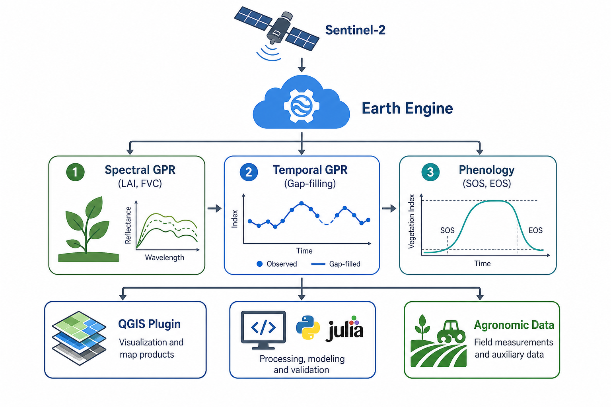
</p>

<h1 align="center">🌽 Monitoreo biofísico y fenológico del maíz en la Orinoquía colombiana</h1>

<h3 align="center">
  Proyecto final — Programación en SIG · Maestría en Geomática
</h3>

<p align="center">
  <strong>Sentinel-2 · Google Earth Engine · Gaussian Process Regression · Python · Julia · MODIS · QGIS Plugin · Quarto</strong>
</p>

<p align="center">
  
  
  
  
  
  
</p>

<p align="center">
  <a href="informe_final_programacion_sig_robusto_v6_tablas_figuras.html"><strong>🌐 Ver informe HTML</strong></a> ·
  <a href="informe_final_programacion_sig_robusto_v6_tablas_figuras.pdf"><strong>📄 Descargar PDF</strong></a> ·
  <a href="informe_final_programacion_sig_robusto_v6_tablas_figuras.docx"><strong>📝 Descargar Word</strong></a> ·
  <a href="informe_final_programacion_sig_robusto_v6_tablas_figuras.qmd"><strong>📘 Fuente Quarto</strong></a>
</p>

---

## 📌 Descripción general del proyecto

Este repositorio contiene el informe final y los materiales computacionales del proyecto **“Monitoreo biofísico y fenológico del maíz en la Orinoquía colombiana mediante Sentinel-2, Google Earth Engine, GPR, Python y Julia”**, desarrollado en el marco de la asignatura **Programación en SIG** de la **Maestría en Geomática**.

El objetivo central del proyecto fue construir, documentar y presentar un flujo reproducible de ciencia de datos espaciales para estimar variables biofísicas del cultivo de maíz —**LAI**, **FVC** y **laiCab**— a partir de imágenes Sentinel-2, modelos de **Regresión por Procesos Gaussianos (GPR)**, reconstrucción temporal mediante **gap-filling**, extracción de métricas fenológicas **LSP** y validación complementaria con **MODIS MCD15A3H**.

El trabajo integra dos escalas de análisis:

1. **Fase regional 2023 — Puerto Gaitán, Meta**  
   Evaluación regional sobre polígonos industriales de maíz derivados de UPRA, con 408 parcelas iniciales, 328 parcelas válidas, 40 imágenes Sentinel-2 y aproximadamente 25.113 ha analizadas.

2. **Fase finca 2024 — Finca La Esperanza, Meta**  
   Evaluación detallada sobre una unidad productiva de 755,44 ha de perímetro y 720,83 ha de área efectiva de monitoreo, con 49 imágenes Sentinel-2 y 47 productos gap-filled por variable.

Además, el repositorio incluye una fase de **validación externa con MODIS**, una capa de **verificación numérica en Julia**, scripts de procesamiento en **Python**, código de procesamiento en **Google Earth Engine / JavaScript**, un **plugin QGIS** como aporte instrumental y un informe reproducible en **Quarto**.

---

## 🧭 Resumen científico

La teledetección satelital y la programación geoespacial permiten monitorear de forma reproducible variables biofísicas y fenológicas del maíz en regiones tropicales. En la Orinoquía colombiana, este seguimiento es limitado por la alta nubosidad, la discontinuidad de imágenes ópticas y la escasa validación in situ, lo que dificulta obtener series temporales continuas para la gestión agrícola.

Este proyecto se justifica por la necesidad de integrar ciencia abierta, Google Earth Engine, Python, Julia y herramientas SIG para generar productos espaciales reproducibles y transferibles. La metodología integró dos escalas: una fase regional 2023 en Puerto Gaitán con 408 parcelas UPRA, 328 parcelas válidas, 40 imágenes Sentinel-2 y 25.113 ha; y una fase 2024 en la Finca La Esperanza, con 755,44 ha de perímetro, 720,83 ha de AOI, 49 imágenes Sentinel-2 y 47 productos gap-filled.

En 2023, los modelos alcanzaron **R² entre 0,776 y 0,847**, con **NRMSE cercano al 13%**. En 2024, la validación cruzada GPR vs. gap-filled mostró **R² = 0,904 para LAI**, **R² = 0,956 para FVC** y **R² = 0,915 para laiCab**. La validación externa con MODIS incluyó 500 puntos y 1.057 observaciones emparejadas, con **RMSE = 1,28 m²/m² para LAI** y **RMSE = 0,286 para FVC**. En conjunto, el flujo Sentinel-2–GEE–GPR–Python–Julia constituye una base reproducible para el monitoreo fenológico del maíz tropical.

---

## 🧪 Componentes tecnológicos principales

<table>
<tr><td width="25%"><strong>Google Earth Engine</strong></td><td>Procesamiento satelital en la nube, filtrado Sentinel-2, máscaras de nubes, estimación GPR y generación de productos raster.</td></tr>
<tr><td><strong>Python</strong></td><td>Descarga de productos GEE, control de calidad, análisis estadístico, validación y generación de figuras finales.</td></tr>
<tr><td><strong>Julia</strong></td><td>Verificación numérica de componentes del modelo, especialmente kernel RBF, matrices de covarianza y métricas de validación.</td></tr>
<tr><td><strong>MODIS MCD15A3H</strong></td><td>Validación externa de LAI y FVC/FPAR con composiciones de cuatro días a 500 m.</td></tr>
<tr><td><strong>QGIS Plugin</strong></td><td>Desarrollo instrumental para trasladar el flujo GPR–gap-filling–LSP a un entorno SIG de escritorio.</td></tr>
<tr><td><strong>Quarto</strong></td><td>Integración del informe científico, código suplementario, figuras, tablas, referencias y anexos reproducibles.</td></tr>
</table>

---

## 🖼️ Galería de resultados principales

### 1. Área regional 2023 — Puerto Gaitán, Meta

<p align="center">
  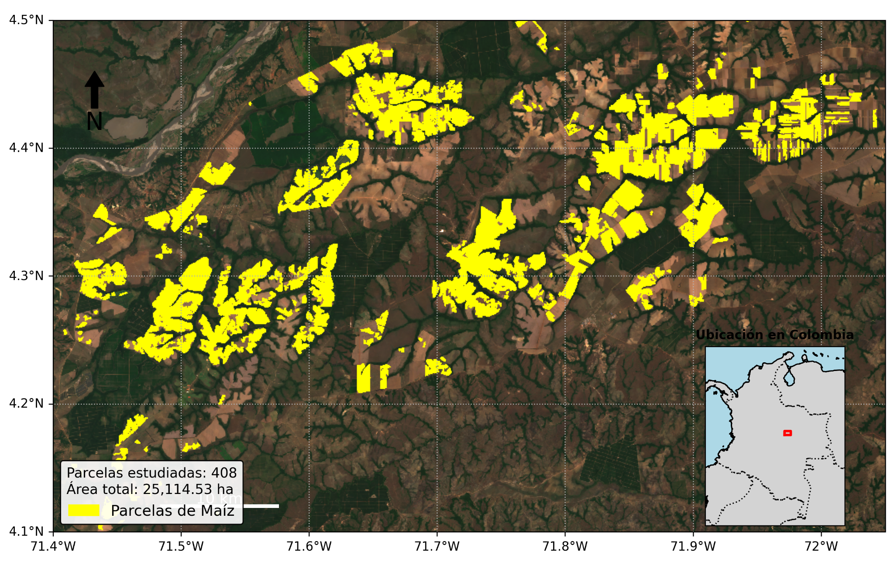
</p>

**Descripción.** Mapa del área regional de estudio en Puerto Gaitán, Meta, con polígonos industriales de maíz derivados de UPRA y utilizados como máscara temática para el procesamiento Sentinel-2.

### 2. Validación cruzada regional GPR vs. gap-filled

<p align="center">
  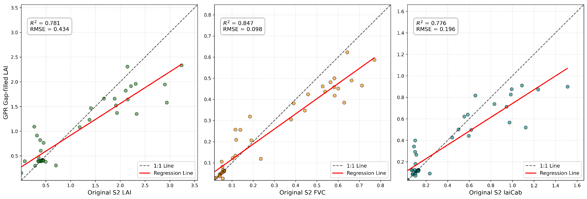
</p>

**Descripción.** Comparación entre observaciones directas Sentinel-2/GPR y productos reconstruidos mediante gap-filling para LAI, FVC y laiCab en la fase regional 2023.

### 3. Series temporales regionales 2023

<p align="center">
  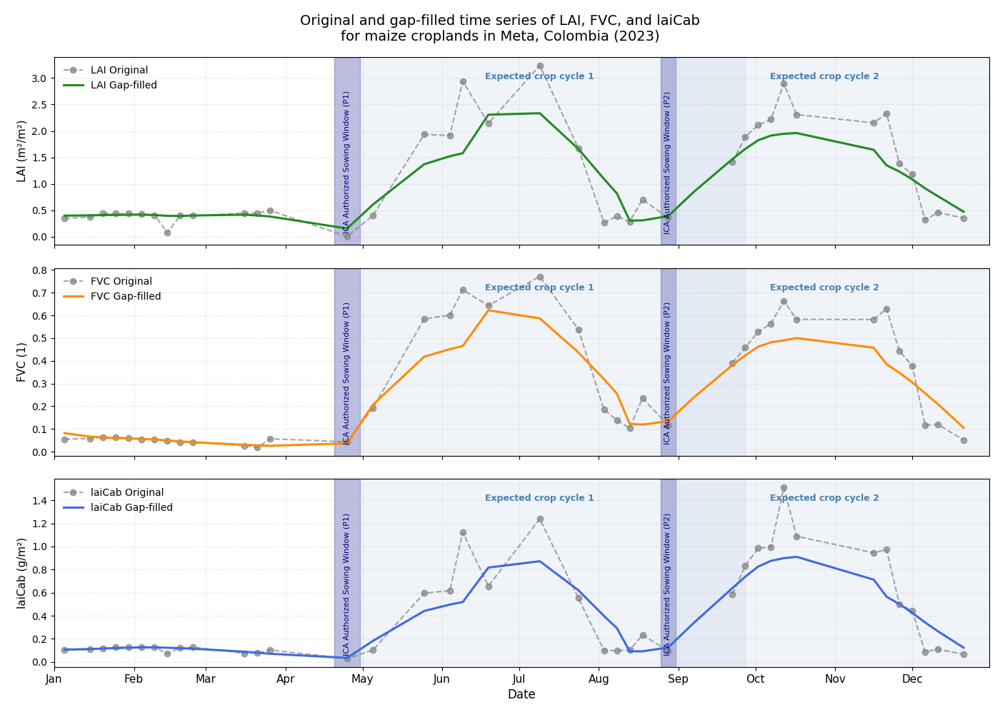
</p>

**Descripción.** Reconstrucción temporal de LAI, FVC y laiCab para el año 2023, evidenciando la dinámica bimodal asociada a dos ciclos de cultivo en la región.

### 4. Área de estudio 2024 — Finca La Esperanza

<p align="center">
  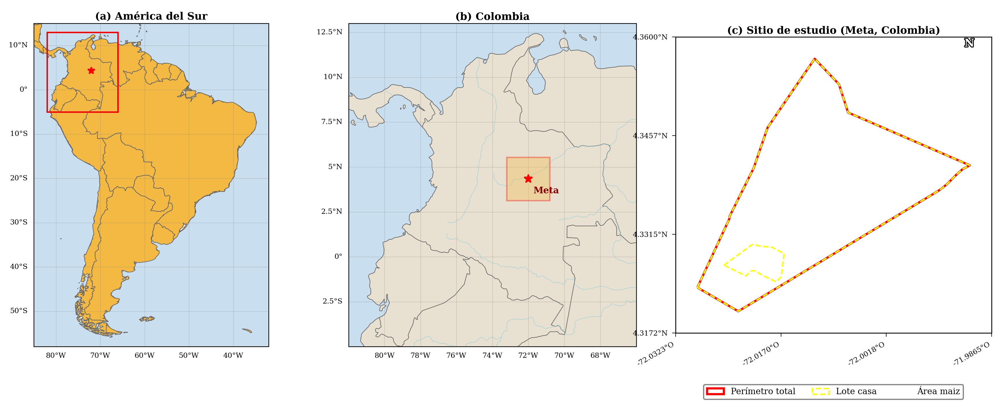
</p>

**Descripción.** Localización y delimitación del área efectiva de monitoreo en la Finca La Esperanza, Meta, correspondiente a la fase de análisis detallado 2024.

### 5. Validación GPR vs. gap-filled en finca

<p align="center">
  
</p>

**Descripción.** Evaluación de consistencia interna entre productos GPR directos y productos reconstruidos temporalmente para LAI, FVC y laiCab en la finca.

### 6. Mapas biofísicos por ciclo fenológico

<p align="center">
  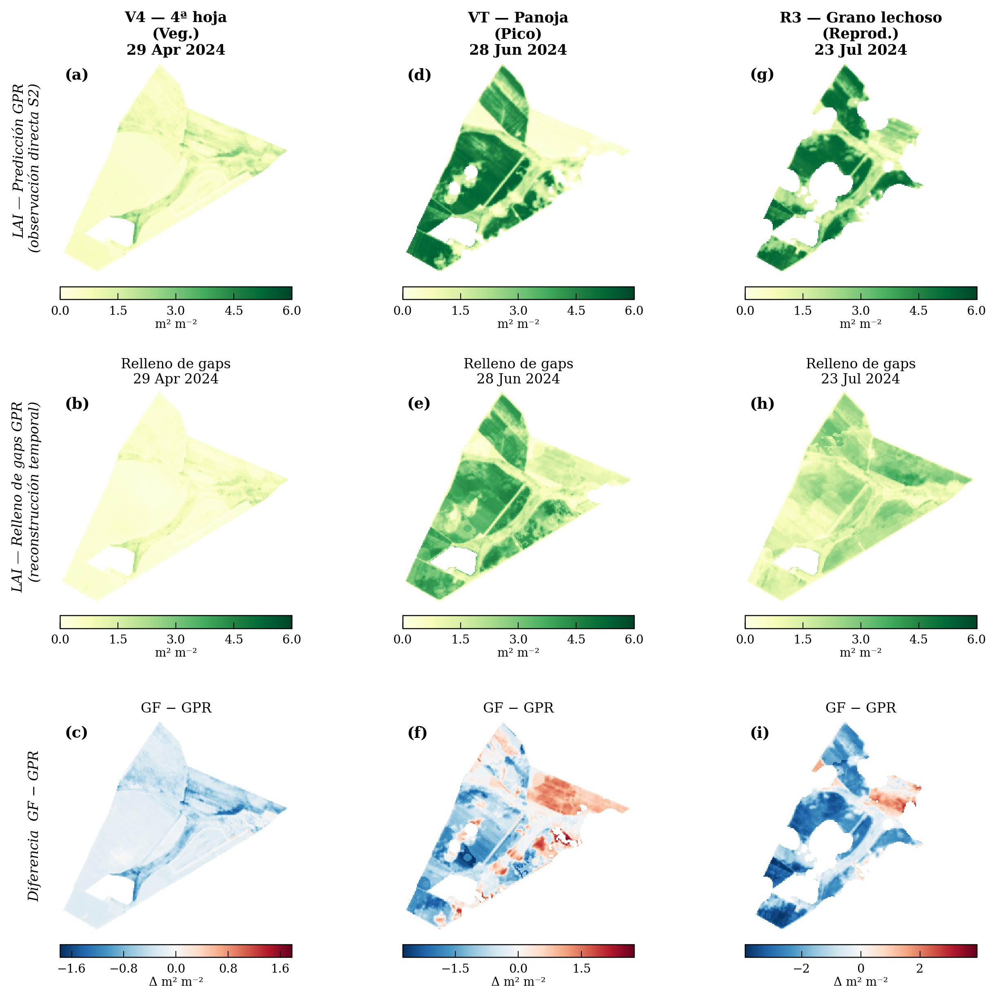
</p>

<p align="center">
  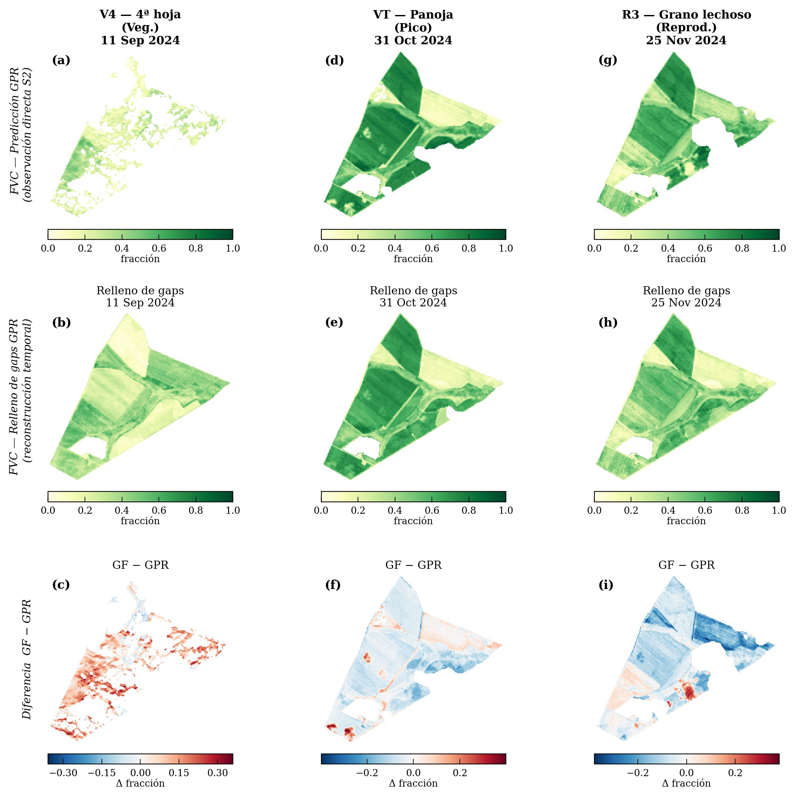
</p>

<p align="center">
  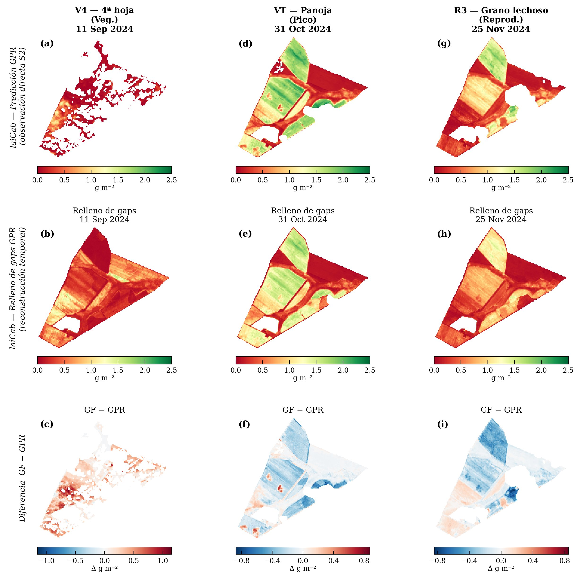
</p>

**Descripción.** Distribución espacial de LAI, FVC y laiCab durante etapas fenológicas clave de los ciclos de cultivo, comparando productos GPR directos, productos gap-filled y diferencias entre ambos.

### 7. Perfiles temporales y métricas LSP

<p align="center">
  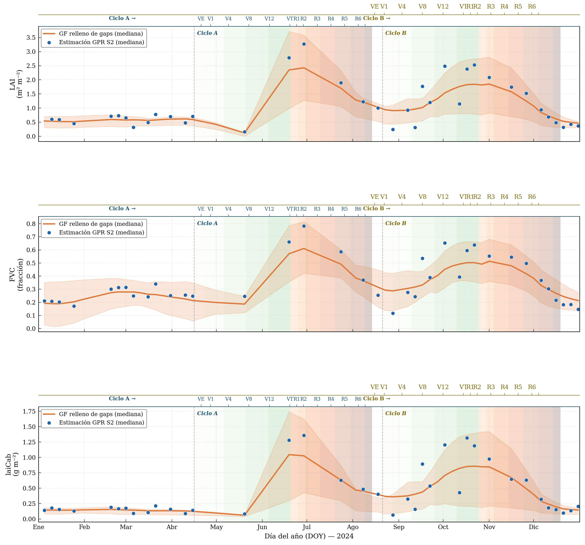
</p>

<p align="center">
  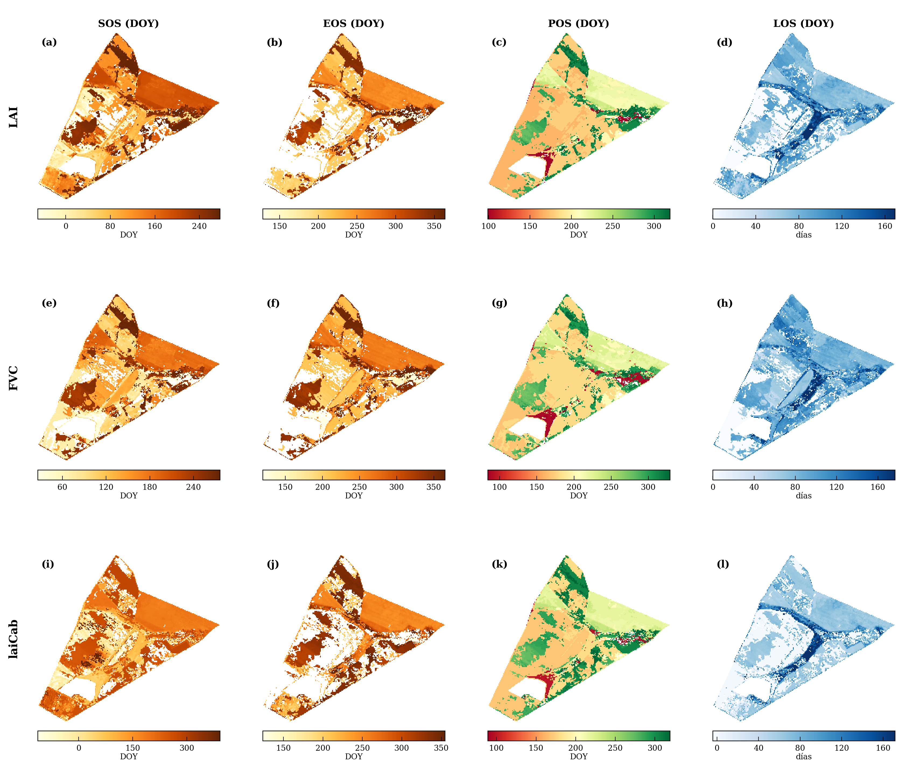
</p>

**Descripción.** Perfiles temporales anuales y métricas de fenología de superficie terrestre —SOS, POS, EOS y LOS— derivadas mediante ajuste doble logístico.

### 8. Plugin QGIS — GEE GPR Phenology

<p align="center">
  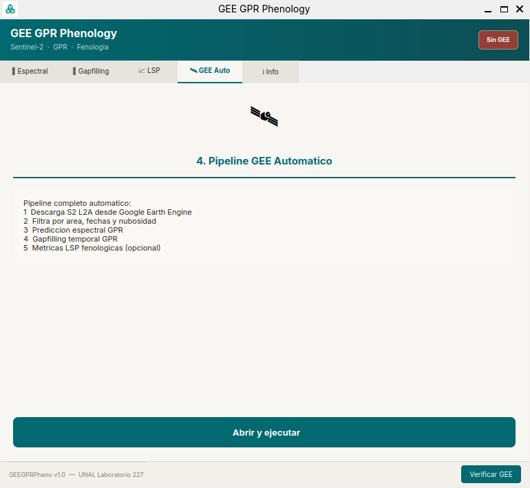
</p>

**Descripción.** Interfaz gráfica del plugin desarrollado para QGIS 3, orientado a facilitar la aplicación del flujo GPR–gap-filling–LSP en un entorno SIG de escritorio.

### 9. Validación externa con MODIS

<p align="center">
  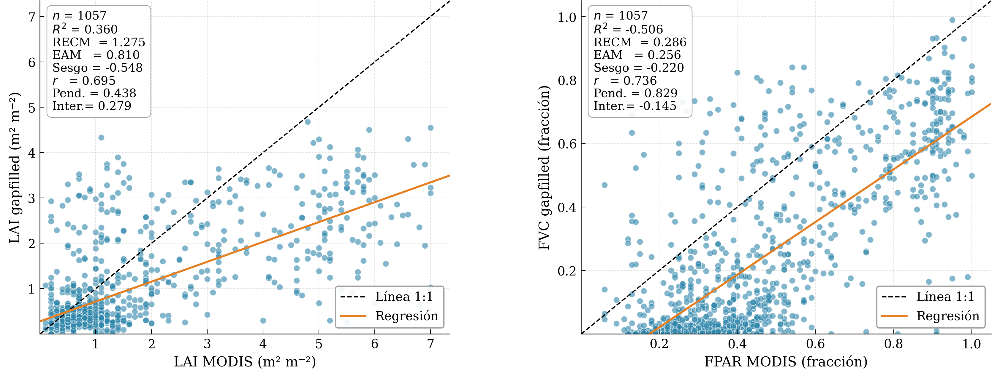
</p>

**Descripción.** Diagramas de dispersión entre LAI MODIS vs. LAI gap-filled y FPAR MODIS vs. FVC gap-filled, con línea 1:1 y recta de regresión lineal.

---

## 📂 Estructura del repositorio

```text
proyecto_final_programacion_sig/
├── GEE_Downloads_tiff/
├── anexos_codigo/
├── code/
├── code_modis/
├── figuras_analysis/
├── figuras_finales/
│   ├── 00_flujo_general/
│   ├── 01_regional_2023/
│   ├── 02_finca_2024/
│   ├── 03_plugin_qgis/
│   └── 04_validacion_modis/
├── plugin_qgis/
├── scripts_julia/
├── tools/
├── .gitignore
├── CHECKLIST_FINAL.md
├── GUIA_ORGANIZACION_FIGURAS.md
├── Project.toml
├── README.md
├── environment.yml
├── informe_final_programacion_sig_robusto_v6_tablas_figuras.docx
├── informe_final_programacion_sig_robusto_v6_tablas_figuras.html
├── informe_final_programacion_sig_robusto_v6_tablas_figuras.pdf
├── informe_final_programacion_sig_robusto_v6_tablas_figuras.qmd
└── styles.css
```

---

## 📁 Descripción detallada de carpetas y archivos

<details open>
<summary><strong>GEE_Downloads_tiff/</strong></summary>

Contiene los productos raster descargados desde Google Earth Engine en formato GeoTIFF. Esta carpeta almacena estimaciones GPR directas, productos gap-filled, productos LSP y archivos por fecha y por variable. Estos archivos constituyen la base espacial del análisis y permiten reproducir o inspeccionar los mapas generados en el informe.

</details>

<details>
<summary><strong>anexos_codigo/</strong></summary>

Contiene el anexo Quarto con el código completo del proyecto. Su función es permitir que el informe mantenga una narrativa científica legible, mientras el código completo queda disponible como material suplementario.

Archivo principal esperado:

```text
anexos_codigo/anexo_codigo_completo.qmd
```

</details>

<details>
<summary><strong>code/</strong></summary>

Carpeta principal de scripts del flujo GEE/Python. Incluye el núcleo computacional del proyecto: scripts de Google Earth Engine / JavaScript para procesamiento satelital y scripts Python para descarga, control de calidad, validación y generación de figuras.

</details>

<details>
<summary><strong>code_modis/</strong></summary>

Contiene los scripts específicos para la validación externa con MODIS MCD15A3H. Su propósito es comparar los productos Sentinel-2/GPR/gap-filled con productos MODIS de LAI y FPAR.

</details>

<details>
<summary><strong>figuras_analysis/</strong></summary>

Contiene figuras intermedias, salidas exploratorias y productos gráficos generados durante el análisis. Funciona como espacio de trabajo gráfico antes de seleccionar las figuras definitivas.

</details>

<details>
<summary><strong>figuras_finales/</strong></summary>

Contiene únicamente las figuras organizadas y seleccionadas para el informe final. Esta es la carpeta que usa directamente el archivo `.qmd`.

Subcarpetas:

- `00_flujo_general/`: flujo metodológico general.
- `01_regional_2023/`: fase regional Puerto Gaitán 2023.
- `02_finca_2024/`: fase Finca La Esperanza 2024.
- `03_plugin_qgis/`: material visual del plugin QGIS.
- `04_validacion_modis/`: resultados de validación externa con MODIS.

</details>

<details>
<summary><strong>plugin_qgis/</strong></summary>

Carpeta reservada para documentar o alojar el desarrollo del plugin **GEE GPR Phenology para QGIS 3**. El plugin se organiza alrededor de cuatro módulos conceptuales:

1. **Spectral GPR** — estimación de variables biofísicas desde reflectancias Sentinel-2.
2. **Gap-filling GPR** — reconstrucción temporal de series incompletas.
3. **LSP Generator** — extracción de SOS, POS, EOS y LOS.
4. **GEE Auto** — automatización de descarga y conexión con Google Earth Engine.

</details>

<details>
<summary><strong>scripts_julia/</strong></summary>

Contiene scripts en Julia para fortalecer la reproducibilidad numérica del proyecto. Julia se usa como capa complementaria para revisar kernel RBF, matrices de covarianza, operaciones de GPR temporal y métricas de validación.

</details>

<details>
<summary><strong>tools/</strong></summary>

Contiene scripts auxiliares para automatizar tareas del repositorio. El uso principal es la generación automática del anexo de código:

```bash
python tools/generar_anexos_codigo_v2.py
```

</details>

---

## 🔁 Flujo metodológico reproducible

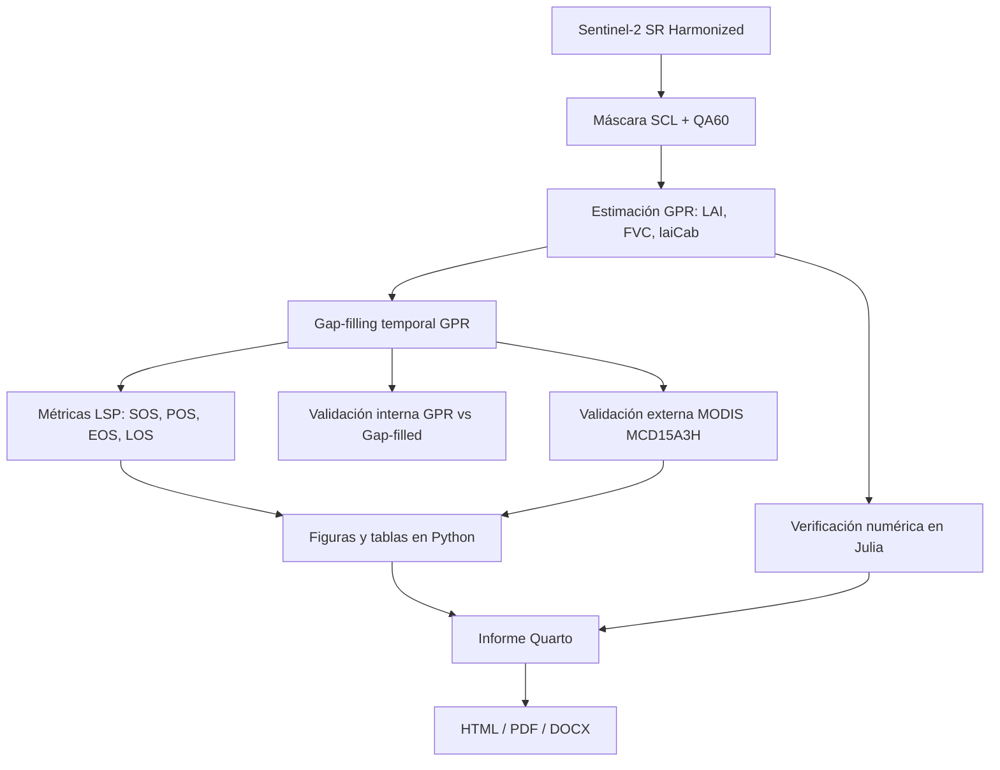

---

## ⚙️ Reproducción del proyecto

### 1. Clonar el repositorio

```bash
git clone https://github.com/jf-floresriera/proyecto_final_programacion_sig.git
cd proyecto_final_programacion_sig
```

### 2. Crear el entorno Python

```bash
conda env create -f environment.yml
conda activate proyecto_final_sig
```

Si el nombre real del ambiente dentro de `environment.yml` es diferente, usar el nombre indicado en ese archivo.

### 3. Instalar dependencias Julia

```bash
julia --project=. -e 'using Pkg; Pkg.instantiate()'
```

### 4. Generar el anexo de código

```bash
python tools/generar_anexos_codigo_v2.py
```

Si se desea usar el generador original:

```bash
python tools/generar_anexos_codigo.py
```

### 5. Renderizar el informe Quarto

```bash
quarto render informe_final_programacion_sig_robusto_v6_tablas_figuras.qmd --to html
quarto render informe_final_programacion_sig_robusto_v6_tablas_figuras.qmd --to docx
quarto render informe_final_programacion_sig_robusto_v6_tablas_figuras.qmd --to pdf
```

---

## 🐳 Uso dentro de Docker

El proyecto fue organizado para poder renderizarse desde un contenedor con Quarto. Una ruta de trabajo típica es:

```bash
cd /home/rstudio/work/proyecto_final_programacion_sig
```

Flujo mínimo:

```bash
python tools/generar_anexos_codigo_v2.py

quarto render informe_final_programacion_sig_robusto_v6_tablas_figuras.qmd --to html
quarto render informe_final_programacion_sig_robusto_v6_tablas_figuras.qmd --to docx
quarto render informe_final_programacion_sig_robusto_v6_tablas_figuras.qmd --to pdf
```

---

## 🧮 Resultados clave

| Componente | Resultado |
|---|---:|
| Parcelas regionales iniciales 2023 | 408 |
| Parcelas regionales válidas 2023 | 328 |
| Imágenes Sentinel-2 usadas en 2023 | 40 |
| Área regional aproximada | 25.113 ha |
| Perímetro Finca La Esperanza 2024 | 755,44 ha |
| AOI efectiva Finca La Esperanza | 720,83 ha |
| Imágenes Sentinel-2 usadas en 2024 | 49 |
| Productos gap-filled por variable | 47 |
| R² regional 2023 | 0,776–0,847 |
| NRMSE regional 2023 | ~13% |
| R² LAI 2024 GPR vs GF | 0,904 |
| R² FVC 2024 GPR vs GF | 0,956 |
| R² laiCab 2024 GPR vs GF | 0,915 |
| Puntos validación MODIS | 500 |
| Observaciones emparejadas MODIS | 1.057 |
| RMSE LAI vs MODIS | 1,28 m²/m² |
| RMSE FVC vs MODIS/FPAR | 0,286 |

---

## 🧠 Interpretación general de resultados

Los resultados muestran que el flujo basado en Sentinel-2, GPR y gap-filling permite reconstruir series temporales continuas de variables biofísicas en un contexto tropical con alta nubosidad. La fase regional 2023 evidenció una dinámica bimodal coherente con dos ciclos productivos de maíz en Puerto Gaitán, mientras que la fase finca 2024 permitió analizar con mayor detalle la heterogeneidad espacial y temporal de LAI, FVC y laiCab.

La validación interna indicó alta consistencia entre productos GPR directos y productos gap-filled, especialmente para FVC. Sin embargo, tanto la validación interna como la comparación externa con MODIS mostraron una tendencia a la subestimación en valores altos, asociada al suavizado temporal del gap-filling, la diferencia de resolución espacial y la heterogeneidad subpíxel.

El desarrollo complementario en Julia fortalece la transparencia numérica del flujo, mientras que el plugin QGIS representa un aporte instrumental para facilitar la transferencia del método a usuarios técnicos y entornos SIG de escritorio.

---

## 🧩 Notas sobre visualización en GitHub

Este README utiliza elementos compatibles con GitHub Markdown:

- insignias estáticas;
- tablas HTML;
- imágenes relativas del repositorio;
- secciones desplegables mediante `<details>`;
- diagrama Mermaid.

GitHub no ejecuta JavaScript ni CSS personalizado dentro del README por razones de seguridad. Por eso, las “animaciones” se representan de forma clásica mediante badges, diagramas, elementos visuales y bloques desplegables.

---

## 📦 Entregables incluidos

<details>
<summary><strong>📘 Informe Quarto fuente</strong></summary>

```text
informe_final_programacion_sig_robusto_v6_tablas_figuras.qmd
```

Archivo principal editable. Debe considerarse la fuente oficial del informe.

</details>

<details>
<summary><strong>🌐 Informe HTML</strong></summary>

```text
informe_final_programacion_sig_robusto_v6_tablas_figuras.html
```

Formato recomendado para lectura digital e inspección del código desplegable.

</details>

<details>
<summary><strong>📄 Informe PDF</strong></summary>

```text
informe_final_programacion_sig_robusto_v6_tablas_figuras.pdf
```

Formato recomendado para entrega académica formal.

</details>

<details>
<summary><strong>📝 Informe Word</strong></summary>

```text
informe_final_programacion_sig_robusto_v6_tablas_figuras.docx
```

Formato útil para corrección editorial y revisión con comentarios.

</details>

---

## 🚀 Cómo citar o reutilizar este repositorio

Este repositorio puede ser usado como base metodológica para proyectos de:

- monitoreo fenológico agrícola;
- estimación de variables biofísicas con Sentinel-2;
- análisis de series temporales satelitales;
- validación cruzada de productos raster;
- integración GEE–Python–Julia–Quarto;
- desarrollo de reportes reproducibles en SIG;
- prototipos de herramientas SIG para agricultura tropical.

Al reutilizarlo, se recomienda citar el repositorio y conservar la referencia al informe final.

---

## 👤 Autor

**Jesús Enrique Flores Riera**  
Laboratorio 227 · Universidad Nacional de Colombia  
Facultad de Ciencias Agrarias · Maestría en Geomática

---

## 📚 Referencias conceptuales principales

Este proyecto se apoya conceptualmente en literatura sobre:

- Google Earth Engine como plataforma de análisis geoespacial planetario.
- Modelos GPR para estimación de variables biofísicas.
- PROSAIL y modelos híbridos para inversión biofísica.
- Series temporales Sentinel-2.
- Gap-filling temporal mediante aprendizaje estadístico.
- Fenología de superficie terrestre.
- Validación de productos LAI/FVC con MODIS.
- Ciencia abierta y reproducibilidad computacional.

Las referencias completas están incluidas en el informe Quarto.

---

<p align="center">
  <strong>🌽 Proyecto final reproducible · Programación en SIG · Maestría en Geomática 🌎</strong>
</p>
