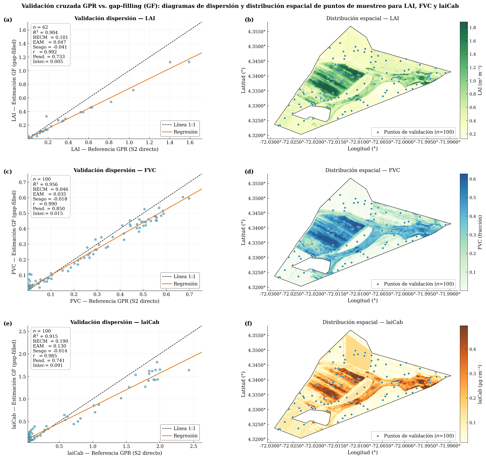
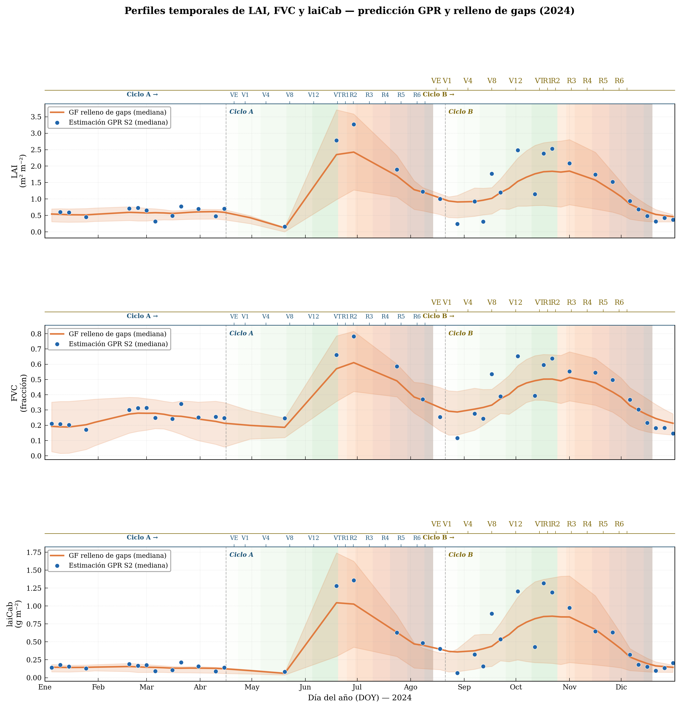
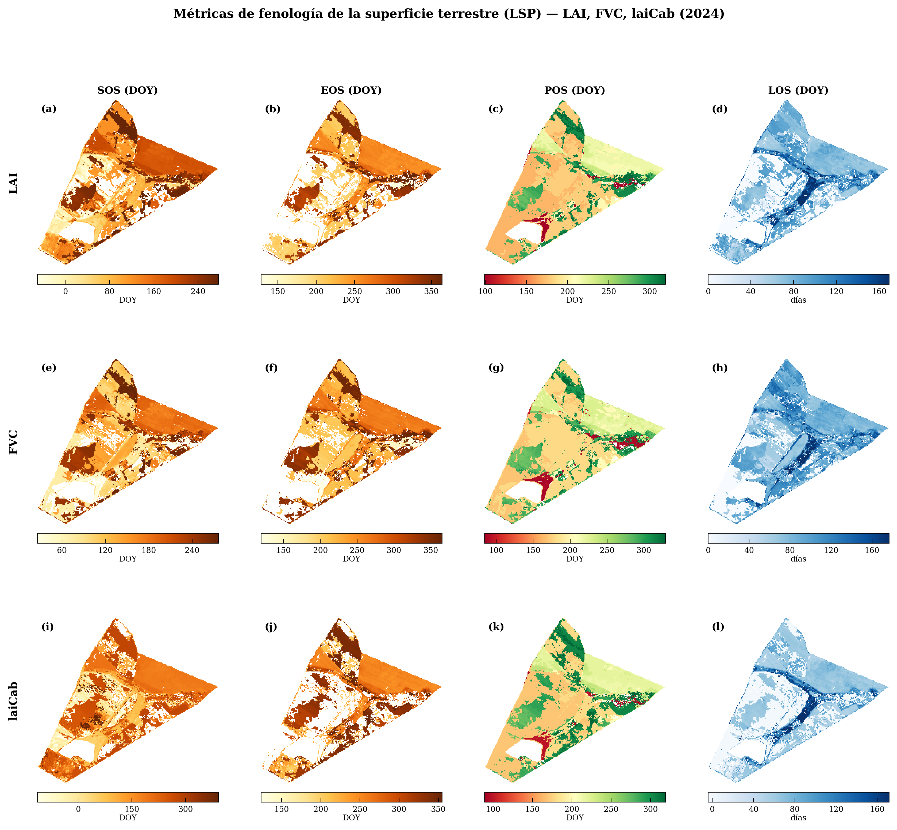

::: {.callout-note title="Criterio de construcción del informe"}
Este documento unifica los dos avances desarrollados durante el curso y conserva su profundidad técnica, sus tablas, su revisión bibliográfica y su lógica metodológica. El informe se organizó como un producto de **Programación en SIG**, por lo que no se limita a presentar mapas: documenta el flujo computacional, los scripts, los datos, el entorno de ejecución, las figuras y los criterios de validación. Todos los bloques de código se dejan con `eval: false` para que el documento pueda renderizarse sin ejecutar nuevamente Google Earth Engine, Python o Julia.
:::

# Título del proyecto

**Monitoreo biofísico y fenológico del maíz en la Orinoquía colombiana mediante Sentinel-2, Google Earth Engine, Regresión por Procesos Gaussianos, Python y Julia.**

# Resumen

La teledetección satelital y la programación geoespacial permiten monitorear de forma reproducible variables biofísicas y fenológicas del maíz en regiones tropicales. En la Orinoquía colombiana, este seguimiento es limitado por la alta nubosidad, la discontinuidad de imágenes ópticas y la escasa validación in situ, lo que dificulta obtener series temporales continuas para la gestión agrícola. Este proyecto se justifica por la necesidad de integrar ciencia abierta, Google Earth Engine, Python, Julia y herramientas SIG para generar productos espaciales reproducibles y transferibles. El objetivo fue desarrollar un flujo de Programación en SIG para estimar LAI, FVC y laiCab en maíz mediante Sentinel-2, Regresión por Procesos Gaussianos y reconstrucción temporal gap-filled. La metodología integró dos escalas: una fase regional 2023 en Puerto Gaitán con 408 parcelas UPRA, 328 parcelas válidas, 40 imágenes Sentinel-2 y 25.113 ha; y una fase 2024 en la Finca La Esperanza, con 755,44 ha de perímetro, 720,83 ha de AOI, 49 imágenes Sentinel-2 y 47 productos gap-filled. En 2023, los modelos alcanzaron R² entre 0,776 y 0,847, con NRMSE cercano al 13%. En 2024, la validación cruzada GPR vs. gap-filled mostró R² de 0,904 para LAI, 0,956 para FVC y 0,915 para laiCab. La validación externa con MODIS incluyó 500 puntos y 1.057 observaciones emparejadas, con RMSE de 1,28 para LAI y 0,286 para FVC. Los resultados evidencian patrones bimodales coherentes con dos ciclos de cultivo, aunque con sesgo negativo en valores altos. En conclusión, el flujo Sentinel-2–GEE–GPR–Python–Julia constituye una base reproducible para el monitoreo fenológico del maíz tropical.


**Palabras clave:** Sentinel-2; Google Earth Engine; Regresión por Procesos Gaussianos; maíz; LAI; FVC; laiCab; MODIS; fenología de superficie terrestre; Python; Julia; Orinoquía colombiana.

# Verificación de cumplimiento con la guía del proyecto final

| Criterio exigido en la guía              | Cumplimiento en este informe                                                                                               | Ubicación dentro del documento               |
|------------------------|------------------------|------------------------|
| Título claro y descriptivo               | Integra cultivo, región, sensor, plataforma, método y lenguajes                                                            | Sección 1                                    |
| Introducción y justificación             | Define el problema espacial, agronómico y computacional                                                                    | Sección 3                                    |
| Estado del arte / revisión bibliográfica | Conserva y organiza las referencias sobre Sentinel-2, GPR, PROSAIL, GEE, gap-filling, LSP, cultivos bimodales y validación | Sección 4                                    |
| Objetivos                                | Incluye objetivo general y objetivos específicos                                                                           | Sección 5                                    |
| Área de estudio                          | Integra fase regional 2023 y fase finca 2024                                                                               | Sección 6                                    |
| Fuentes de datos                         | Documenta Sentinel-2, UPRA, AOI, MODIS MCD15A3H, GEE Assets, scripts y repositorios                                        | Sección 7                                    |
| Metodología y código                     | Describe el flujo y presenta bloques de código esenciales con `eval: false`                                                | Sección 8                                    |
| Integración multilingüe                  | Mantiene GEE/JavaScript y Python como flujo principal e incorpora Julia como verificación numérica                         | Secciones 8 y Anexo C                        |
| Desarrollo de software / plugin QGIS     | Incorpora el plugin GEE GPR Phenology como aporte instrumental para trasladar el flujo a QGIS 3                            | Metodología, resultados, discusión y figuras |
| Resultados y discusión                   | Integra resultados de avance regional 2023, avance finca 2024 y validación MODIS                                           | Secciones 9 y 10                             |
| Conclusiones                             | Presenta logros, limitaciones técnicas y mejoras futuras                                                                   | Sección 11                                   |
| Referencias APA                          | Conserva la bibliografía técnica de ambos avances                                                                          | Sección 12                                   |
| Anexo de entorno Docker/virtualización   | Incluye instrucciones para ambiente reproducible                                                                           | Anexo A                                      |
| Código suplementario obligatorio         | Se integra mediante anexos generados automáticamente desde los scripts reales                                              | Anexo C                                      |

# Introducción y justificación

La región de la Orinoquía colombiana, y en particular la Altillanura, constituye una de las principales fronteras agrícolas del país. Su topografía, la posibilidad de mecanización y el régimen climático bimodal han favorecido la expansión de cultivos tecnificados como el maíz amarillo. Sin embargo, esta región presenta limitaciones edafológicas y climáticas que dificultan el seguimiento agronómico continuo: suelos ácidos, baja fertilidad nativa, alta saturación de aluminio, alta nubosidad y ciclos de cultivo que pueden superponerse espacialmente en el calendario anual. Estas condiciones hacen necesario desarrollar herramientas de monitoreo espacial capaces de describir no solo la presencia del cultivo, sino también su estado biofísico y su dinámica fenológica.

Tradicionalmente, el seguimiento del maíz se realiza mediante observaciones de campo, recorridos técnicos, registros de siembra y cosecha, o mediciones directas de variables como altura, cobertura o área foliar. Aunque estas mediciones son esenciales, presentan limitaciones cuando se requiere capturar heterogeneidad espacial a escala de lote, finca o región. La teledetección satelital permite complementar estas observaciones al generar mediciones repetidas en el tiempo y espacialmente explícitas. En particular, Sentinel-2 ofrece bandas en el visible, borde rojo, infrarrojo cercano e infrarrojo de onda corta, con resoluciones compatibles con parcelas agrícolas y con un intervalo temporal adecuado para cultivos de ciclo corto.

No obstante, el uso de imágenes ópticas en regiones tropicales enfrenta un obstáculo central: la cobertura nubosa. La nubosidad, las sombras de nube, los cuerpos de agua, los píxeles saturados y los efectos atmosféricos residuales fragmentan las series temporales y pueden distorsionar la detección de eventos fenológicos como inicio de temporada, pico de desarrollo, senescencia o duración del ciclo. Por esta razón, el proyecto no se limita a calcular índices espectrales simples, sino que adopta una cadena basada en variables biofísicas del dosel y en reconstrucción temporal mediante Regresión por Procesos Gaussianos.

La justificación metodológica se fundamenta en el cambio conceptual desde enfoques basados exclusivamente en índices de vegetación, como NDVI, hacia flujos basados en rasgos biofísicos como LAI, FVC y laiCab. Estos rasgos tienen una interpretación funcional más directa: LAI describe estructura foliar, FVC describe cierre o cobertura de la canopia, y laiCab integra estructura foliar y contenido de clorofila del dosel. En sistemas agrícolas, estas variables permiten interpretar el crecimiento del cultivo de manera más cercana a su funcionamiento ecofisiológico.

Desde la perspectiva de Programación en SIG, este proyecto tiene un valor adicional porque organiza un flujo completo de ciencia de datos espaciales: adquisición de datos, preprocesamiento, modelación biofísica, reconstrucción temporal, derivación de métricas, validación cruzada, validación externa con MODIS, generación de figuras, documentación del entorno y publicación en un repositorio abierto. Por tanto, el producto final no es únicamente un informe académico, sino una guía reproducible para investigadores o profesionales que deseen adaptar esta metodología a otros cultivos, regiones o escalas.

# Estado del arte y revisión bibliográfica

## Teledetección agrícola y variables biofísicas del dosel

La teledetección agrícola ha evolucionado desde el uso operativo de índices espectrales hacia el uso de variables biofísicas con interpretación funcional. Los índices como NDVI o EVI son útiles para describir actividad fotosintética y vigor relativo, pero pueden saturarse en coberturas densas y no siempre representan de manera directa atributos estructurales o fisiológicos del dosel. En contraste, variables como LAI, FVC y laiCab permiten relacionar la señal espectral con procesos agronómicos concretos, tales como expansión foliar, cierre de canopia, fotosíntesis y senescencia.

El índice de área foliar (LAI) se define como la razón entre el área foliar y la superficie de suelo. Es una variable ampliamente utilizada para modelar fotosíntesis, evapotranspiración, balance de carbono y acumulación de biomasa. La fracción de cobertura vegetal (FVC) representa la proporción del suelo cubierta por vegetación verde en proyección vertical, y resulta clave para interpretar cierre de canopia, competencia con malezas y protección del suelo. El contenido de clorofila del dosel (laiCab) representa una variable compuesta que integra estructura foliar y concentración de clorofila, por lo cual puede interpretarse como un indicador de actividad fotosintética agregada.

## Sentinel-2 y monitoreo de cultivos de ciclo corto

Sentinel-2, parte del programa Copernicus, proporciona imágenes multiespectrales con bandas en el visible, red-edge, NIR y SWIR. Estas bandas son particularmente relevantes para estimar variables biofísicas porque el borde rojo y el infrarrojo cercano son sensibles a la estructura del dosel y a la concentración de pigmentos. Para cultivos de ciclo corto como el maíz, la resolución temporal de Sentinel-2 permite reconstruir trayectorias de crecimiento, aunque en zonas tropicales la disponibilidad efectiva de observaciones útiles depende fuertemente del enmascaramiento de nubes y la reconstrucción de series.

En este proyecto se utilizaron imágenes Sentinel-2 Surface Reflectance Harmonized (`COPERNICUS/S2_SR_HARMONIZED`) y las bandas B2, B3, B4, B5, B6, B7, B8, B8A, B11 y B12. La selección de estas bandas es consistente con los modelos GPR de variables biofísicas usados en la literatura y con la necesidad de capturar información del visible, red-edge, NIR y SWIR.

## Regresión por Procesos Gaussianos y modelos híbridos PROSAIL/GPR

La Regresión por Procesos Gaussianos (GPR) es un método de aprendizaje estadístico no paramétrico formulado en un marco bayesiano. Su utilidad en teledetección agrícola radica en que permite modelar relaciones no lineales entre reflectancias multiespectrales y variables biofísicas del dosel. Los modelos híbridos combinan simulaciones de transferencia radiativa, como PROSAIL, con aprendizaje estadístico, permitiendo entrenar modelos transferibles incluso cuando no existen suficientes mediciones de campo locales.

En este trabajo, los modelos GPR se utilizan en dos dominios complementarios. En el dominio espectral, la entrada es el vector de reflectancias Sentinel-2 y la salida es una variable biofísica estimada: LAI, FVC o laiCab. En el dominio temporal, la entrada son fechas de adquisición y observaciones discontinuas, y la salida es una serie temporal reconstruida mediante un kernel RBF. Esta doble aplicación del GPR permite estimar rasgos del dosel y posteriormente reconstruir trayectorias fenológicas continuas.

## Gap-filling temporal y fenología de superficie terrestre

La fenología de superficie terrestre (LSP, Land Surface Phenology) resume la dinámica temporal de superficies vegetadas observadas desde sensores remotos. Sus métricas principales son Start of Season (SOS), Peak of Season (POS), End of Season (EOS) y Length of Season (LOS). En cultivos, estas métricas no siempre equivalen exactamente a eventos fenológicos de campo, pero permiten sintetizar transiciones temporales del dosel de forma espacialmente explícita.

El gap-filling temporal es indispensable cuando las series ópticas presentan vacíos por nubosidad. En este proyecto, la reconstrucción se realiza mediante GPR temporal con kernel RBF, usando ventanas de ±30 días alrededor de cada fecha objetivo. Posteriormente, se ajusta una función doble logística a las series reconstruidas para derivar métricas LSP. Esta estrategia sigue el marco conceptual de Salinero-Delgado et al. (2022) y Pipia et al. (2021), adaptado a condiciones tropicales colombianas.

## Validación interna, validación bibliográfica y validación externa

La validación de productos biofísicos satelitales puede abordarse de varias formas. La validación ideal incluiría mediciones in situ sincronizadas con los pasos del satélite mediante instrumentos como LAI-2200, fotografía hemisférica o muestreo destructivo. Sin embargo, estas campañas son costosas y difíciles de implementar en regiones con restricciones logísticas. Por esta razón, este trabajo combina tres estrategias complementarias:

1.  **Validación cruzada interna**, comparando el producto GPR directo contra el producto gap-filled.
2.  **Validación por concordancia agronómica**, contrastando los valores observados con calendarios fenológicos documentados y rangos bibliográficos de LAI, FVC y laiCab.
3.  **Validación externa con MODIS**, comparando LAI y FVC derivados de Sentinel-2/GPR contra LAI y FPAR del producto MODIS MCD15A3H v6.1.

Estas estrategias no reemplazan la validación de campo, pero permiten evaluar consistencia interna, coherencia agronómica y concordancia con productos biofísicos globales.

# Objetivos

## Objetivo general

Implementar y documentar un flujo reproducible de Programación en SIG para estimar, reconstruir, validar y analizar variables biofísicas y métricas fenológicas del cultivo de maíz en la Orinoquía colombiana, integrando Sentinel-2, Google Earth Engine, Regresión por Procesos Gaussianos, Python y Julia bajo principios de ciencia abierta.

## Objetivos específicos

1.  Adaptar una cadena GPR basada en Sentinel-2 para estimar LAI, FVC y laiCab en dos escalas de análisis: parcelas industriales regionales de maíz en Puerto Gaitán durante 2023 y la Finca La Esperanza durante 2024.
2.  Reconstruir series temporales de variables biofísicas mediante gap-filling GPR y derivar métricas de fenología de superficie terrestre, incluyendo SOS, POS, EOS y LOS.
3.  Evaluar la consistencia del flujo mediante validación cruzada GPR vs gap-filled, validación con rangos bibliográficos y calendario fenológico, y validación externa con MODIS MCD15A3H para el caso regional 2023.
4.  Integrar el código en el informe final mediante bloques documentados de Google Earth Engine/JavaScript, Python y Julia, manteniendo reproducibilidad y trazabilidad del repositorio.

# Área de estudio

## Fase I: Puerto Gaitán, Meta, 2023

La primera fase del proyecto se desarrolló en Puerto Gaitán, Meta, Colombia, en un conjunto regional de parcelas industriales de maíz. El área fue definida a partir de polígonos de maíz industrial de la UPRA para 2023. La delimitación incluyó inicialmente 408 parcelas, con un área total aproximada de 25,113.53 ha. Después de filtrar la disponibilidad de observaciones válidas de Sentinel-2, el análisis final se realizó sobre 328 parcelas con datos útiles. Esta fase permitió evaluar la transferibilidad del flujo GPR en una escala regional de producción industrial.

**Figura sugerida:** localización del área regional 2023 y parcelas UPRA.

```{markdown}
#| eval: false
{#fig-area-2023}
```

## Fase II: Finca La Esperanza, Meta, 2024

La segunda fase se desarrolló en la Finca La Esperanza, ubicada en el departamento del Meta, en la región de la Orinoquía colombiana. El sitio corresponde a una unidad productiva con ensayos regionales de variedades de maíz bajo condiciones de sabana bien drenada. El perímetro total de la finca se documentó en 755.44 ha, de las cuales 34.62 ha corresponden al Lote Casa excluido del análisis, dejando 720.83 ha como área neta de monitoreo.

| Unidad geográfica            | Superficie (ha) | Porcentaje (%) |
|------------------------------|----------------:|---------------:|
| Perímetro total finca        |          755.44 |          100.0 |
| Lote Casa (excluido)         |           34.62 |            4.6 |
| Área neta de monitoreo (AOI) |          720.83 |           95.4 |

**Figura sugerida:** localización de la Finca La Esperanza y AOI.

```{markdown}
#| eval: false
{#fig-area-2024}
```

# Fuentes de datos

## Sentinel-2 Surface Reflectance Harmonized

Se utilizó la colección `COPERNICUS/S2_SR_HARMONIZED`, filtrada espacialmente por el AOI y temporalmente por año de estudio. En 2023, para la fase regional, se filtraron imágenes entre el 1 de enero y el 31 de diciembre de 2023 con `CLOUDY_PIXEL_PERCENTAGE < 80`, obteniendo 40 imágenes para análisis. En 2024, para Finca La Esperanza, se filtraron imágenes del tile MGRS 18NZK, también con umbral de nubosidad inferior al 80 %, obteniendo 49 imágenes válidas y 47 productos gap-filled por variable biofísica.

Las bandas usadas para la inversión GPR fueron B2, B3, B4, B5, B6, B7, B8, B8A, B11 y B12. Estas bandas cubren visible, red-edge, NIR y SWIR, y se remuestrearon a 20 m cuando fue necesario.

## Polígonos UPRA y área agrícola regional

Para la fase 2023 se utilizaron polígonos de maíz industrial de Meta, obtenidos de la colección temática de UPRA. Estos polígonos funcionaron como máscara espacial del cultivo y permitieron limitar el análisis a parcelas agrícolas de interés.

## Área de interés de Finca La Esperanza

Para 2024 se trabajó con el AOI de la Finca La Esperanza. Se excluyó el lote de infraestructura o vivienda para evitar que superficies no agrícolas afectaran la estimación de variables biofísicas.

## MODIS MCD15A3H v6.1

La validación externa de LAI y FVC para el estudio regional 2023 se realizó con el producto MODIS MCD15A3H v6.1. Este producto proporciona composiciones de cuatro días a 500 m de resolución espacial. Se usaron las bandas LAI y FPAR, aplicando sus factores de escala: LAI × 0.1 y FPAR × 0.01. En este informe, FPAR se usa como referencia funcional para comparar con FVC, reconociendo que no son variables idénticas pero sí están relacionadas con la cobertura y absorción de radiación fotosintéticamente activa.

## Scripts y repositorio

El repositorio del proyecto contiene la estructura de código y resultados usada para reproducir el flujo. La organización principal es:

```{bash}
#| eval: false
sentinel2-maize-gaussian-processes/
├── code/
│   ├── 1_Paso_GEE_Adaptado.js
│   ├── 2_Paso_GEE_Adaptado.js
│   ├── 3_Paso_GEE_Adaptado.js
│   ├── a_descargar_GEE.py
│   ├── b_calidad.py
│   ├── c_validacion.py
│   └── d_graficas_articulo5.py
├── code_modis/
│   ├── validacion_modis_gee.js
│   └── validacion_modis_python.py
├── scripts_julia/
│   ├── gpr_temporal_kernel_check.jl
│   └── validacion_modis_metricas.jl
├── plugin_qgis/                # opcional: copia o submódulo del plugin GEE GPR Phenology
│   └── README_plugin.md
├── GEE_Downloads_tiff/
├── figuras_analysis/
├── figuras_finales/
├── environment.yml
├── Project.toml
└── informe_final_programacion_sig_robusto.qmd
```

# Metodología y código

## Diseño general del flujo de trabajo

El flujo metodológico se estructuró en ocho fases: (1) delimitación del área de estudio, (2) filtrado y preprocesamiento de Sentinel-2, (3) estimación de variables biofísicas mediante GPR espectral, (4) reconstrucción temporal mediante gap-filling GPR, (5) extracción de métricas LSP mediante doble logística, (6) validación y análisis local con Python, (7) verificación numérica complementaria con Julia, y (8) desarrollo instrumental de un plugin para QGIS 3 orientado a trasladar el flujo GPR--gap-filling--LSP a un entorno de escritorio de código abierto.

**Figura sugerida:** diagrama de flujo GEE + Python + Julia.

```{markdown}
#| eval: false
{#fig-workflow}
```

## Preprocesamiento Sentinel-2: máscara SCL + QA60

El preprocesamiento consistió en excluir píxeles no válidos mediante la combinación de dos fuentes de calidad de Sentinel-2: la banda SCL y la máscara QA60. Se excluyeron clases asociadas con saturación o defectos, sombras, agua, nubes de probabilidad media o alta, cirros y nieve. Adicionalmente, se filtraron los bits 10 y 11 de QA60 para remover nubes y cirros.

```{javascript}
#| eval: false
// Fragmento conceptual: máscara SCL + QA60 en Google Earth Engine
function maskS2sr(image) {
  var scl = image.select('SCL');
  var qa = image.select('QA60');

  var sclMask = scl.neq(1)
    .and(scl.neq(2))
    .and(scl.neq(3))
    .and(scl.neq(6))
    .and(scl.neq(7))
    .and(scl.neq(8))
    .and(scl.neq(9))
    .and(scl.neq(10))
    .and(scl.neq(11));

  var cloudBitMask = ee.Number(2).pow(10).int();
  var cirrusBitMask = ee.Number(2).pow(11).int();
  var qaMask = qa.bitwiseAnd(cloudBitMask).eq(0)
    .and(qa.bitwiseAnd(cirrusBitMask).eq(0));

  return image.updateMask(sclMask).updateMask(qaMask)
    .copyProperties(image, ['system:time_start']);
}
```

## Estimación de variables biofísicas mediante GPR espectral

La estimación píxel a píxel se realizó usando modelos GPR preentrenados sobre datos sintéticos PROSAIL/ALEBD con configuración Sentinel-2. La predicción media del GPR puede expresarse como:

$$
\hat{y}(x_*) = k_*^T \alpha + \mu
$$

donde $x_*$ es el vector de reflectancias Sentinel-2 del píxel, $k_*$ es el vector de covarianzas entre el píxel y las muestras de entrenamiento, $\alpha$ son los coeficientes aprendidos y $\mu$ es la media del modelo. La similitud espectral se calcula mediante un kernel RBF anisotrópico:

$$
k(x, x') = \sigma_f^2 \exp\left[-\frac{1}{2}\sum_i \frac{(x_i - x'_i)^2}{\ell_i^2}\right]
$$

| Concepto              | Ecuación                                                                                   | Rol en el estudio                                                     |
|------------------------|------------------------|------------------------|
| Predicción media GPR  | $\hat{y}(x_*) = k_*^T\alpha + \mu$                                                         | Estimación de LAI, FVC y laiCab desde reflectancias Sentinel-2        |
| Kernel RBF espectral  | $k(x,x')=\sigma_f^2\exp[-0.5\sum_i (x_i-x'_i)^2/\ell_i^2]$                                 | Similitud espectral entre píxeles y muestras sintéticas PROSAIL/ALEBD |
| Kernel RBF temporal   | $K(t_i,t_j)=\sigma_f^2\exp[-0.5(t_i-t_j)^2/\ell_{ts}^2]$                                   | Similitud temporal durante gap-filling                                |
| Predicción temporal   | $\hat{y}(t_*)=k_*^T(K+\sigma_n^2I)^{-1}y$                                                  | Reconstrucción de series temporales continuas                         |
| Doble logística       | $y(t)=v_{min}+v_{amp}\left[\frac{1}{1+e^{-m_1(t-n_1)}}-\frac{1}{1+e^{-m_2(t-n_2)}}\right]$ | Ajuste de trayectoria fenológica                                      |
| Duración de temporada | $LOS=EOS-SOS$                                                                              | Cálculo de duración del ciclo                                         |

## Gap-filling temporal mediante GPR

Las series Sentinel-2 son discontinuas por nubosidad. Para reconstruirlas, se aplicó GPR temporal con kernel RBF dentro de una ventana de ±30 días alrededor de cada fecha objetivo. Este paso suaviza la serie, reduce ruido atmosférico residual y permite derivar métricas fenológicas, aunque puede atenuar picos de LAI y laiCab durante etapas de máximo desarrollo.

```{julia}
#| eval: false
# Verificación conceptual del kernel RBF temporal en Julia
using LinearAlgebra

function rbf_kernel(t1, t2; ell=30.0, sigma_f=1.0)
    [sigma_f^2 * exp(-0.5 * ((a - b)^2) / ell^2) for a in t1, b in t2]
end

function gpr_predict(t_train, y_train, t_star; ell=30.0, sigma_f=1.0, sigma_n=0.05)
    K = rbf_kernel(t_train, t_train; ell=ell, sigma_f=sigma_f) .+ (sigma_n^2) .* I
    Ks = rbf_kernel(t_train, t_star; ell=ell, sigma_f=sigma_f)
    alpha = cholesky(Symmetric(K)) \ y_train
    return transpose(Ks) * alpha
end
```

## Extracción de métricas LSP

A partir de la serie gap-filled se ajustó una función doble logística para extraer SOS, POS, EOS y LOS. En la fase 2024 también se documentaron métricas adicionales como customSOS/customEOS, valores mínimo y máximo de la curva y parámetros de forma.

| Banda | Métrica             | Descripción                                                       |
|----------------------------:|----------------------|----------------------|
|     1 | SOS                 | Start of Season; inicio de temporada en DOY                       |
|     2 | EOS                 | End of Season; fin de temporada en DOY                            |
|     3 | POS                 | Peak of Season; máximo de la curva en DOY                         |
|     4 | LOS                 | Length of Season; duración del ciclo activo                       |
|   5–6 | customSOS/customEOS | SOS y EOS con umbral relativo personalizado, u = 0.3              |
|   7–8 | v_min / v_max       | Valor mínimo y máximo de la curva doble logística                 |
|  9–12 | n1, m1, n2, m2      | Parámetros de inflexión y pendiente de la función doble logística |

## Calendario fenológico documentado en campo

Para Finca La Esperanza, las etapas fenológicas del maíz se documentaron mediante entrevistas estructuradas con el ingeniero agrónomo responsable de la finca y se contrastaron con la escala de desarrollo de Ritchie y Hanway. Esta tabla es central y debe conservarse porque conecta la señal satelital con el conocimiento agronómico local.

| Etapa                  | Código | Ciclo A (siembra 15 abr) | Ciclo B (siembra 20 ago) | Días acumulados |
|---------------|---------------|---------------|---------------|--------------:|
| Siembra–Emergencia     | VE     | 15–22 abr                | 20–27 ago                |             0–7 |
| 1ª–4ª hoja             | V1–V4  | 22 abr–5 may             | 27 ago–9 sep             |            7–20 |
| 4ª–8ª hoja             | V4–V8  | 5–20 may                 | 9–24 sep                 |           20–35 |
| 8ª–12ª hoja            | V8–V12 | 20 may–4 jun             | 24 sep–9 oct             |           35–50 |
| 12ª hoja–Pretasel      | V12–VT | 4–19 jun                 | 9–24 oct                 |           50–65 |
| Espigamiento masculino | VT     | 19–24 jun                | 24–29 oct                |           65–70 |
| Floración / Silking    | R1     | 24–29 jun                | 29 oct–3 nov             |           70–75 |
| Grano ampollado        | R2     | 29 jun–9 jul             | 3–13 nov                 |           75–85 |
| Grano lechoso          | R3     | 9–19 jul                 | 13–23 nov                |           85–95 |
| Grano masoso           | R4     | 19–29 jul                | 23 nov–3 dic             |          95–105 |
| Grano dentado          | R5     | 29 jul–8 ago             | 3–13 dic                 |         105–115 |
| Madurez fisiológica    | R6     | 8–13 ago                 | 13–18 dic                |         115–120 |

## Rangos bibliográficos de variables biofísicas por etapa fenológica

Esta tabla también debe conservarse porque permite defender la interpretación de LAI, FVC y laiCab en ausencia de una campaña in situ sistemática.

| Etapa                 | Código | LAI (m² m⁻²) | FVC (0–1) | laiCab (g m⁻²) | Fuente principal         |
|------------|------------|-----------:|-----------:|-----------:|------------|
| Emergencia            | VE     |    0.10–0.50 | 0.05–0.20 |      0.10–0.50 | Bacour et al. (2006)     |
| Desarrollo inicial    | V1–V4  |    0.50–1.50 | 0.20–0.40 |      0.10–0.50 | Weiss & Baret (2016)     |
| Desarrollo vegetativo | V4–V8  |    1.50–2.50 | 0.40–0.65 |      0.50–1.50 | Hassanpour et al. (2024) |
| Crecimiento activo    | V8–V12 |    2.50–3.50 | 0.65–0.80 |      0.50–1.50 | Hassanpour et al. (2024) |
| Pretasel              | V12–VT |    3.50–4.50 | 0.80–0.92 |      1.00–2.50 | Sun et al. (2023)        |
| Floración máxima      | VT–R1  |    4.50–6.00 | 0.90–0.98 |      1.50–3.50 | Bacour et al. (2006)     |
| Llenado temprano      | R2–R3  |    3.50–5.00 | 0.80–0.95 |      1.00–2.50 | Casa et al. (2010)       |
| Llenado tardío        | R4–R5  |    2.00–3.50 | 0.65–0.82 |      0.50–1.50 | Weiss & Baret (2016)     |
| Madurez/Senescencia   | R6     |    0.50–1.50 | 0.35–0.60 |      0.20–0.80 | Bacour et al. (2006)     |

## Desarrollo del plugin GEE GPR Phenology para QGIS

Como componente de desarrollo de software y transferencia tecnológica, se incorporó el plugin **GEE GPR Phenology** para QGIS 3 como un aporte instrumental del proyecto. Este componente no reemplaza la cadena principal implementada en Google Earth Engine y Python; su función es trasladar la lógica del flujo a un entorno de escritorio de acceso abierto, más cercano a usuarios técnicos que trabajan habitualmente con SIG de escritorio.

El plugin se concibe como una interfaz operativa para ejecutar o reproducir los pasos principales de la metodología: (1) estimación espectral GPR de variables biofísicas, (2) reconstrucción temporal mediante gap-filling GPR, (3) generación de métricas LSP mediante ajuste doble logístico, y (4) automatización de la descarga de colecciones Sentinel-2 desde Google Earth Engine. En el informe original de la fase 2024, este componente fue presentado como una contribución complementaria desarrollada en Python/NumPy para QGIS 3, con el objetivo de democratizar el acceso a la cadena GPR--gap-filling--LSP y reducir la dependencia exclusiva del Code Editor de GEE.

Desde el punto de vista de Programación en SIG, el plugin se incluye porque evidencia una transición desde un script académico hacia una herramienta reutilizable. En lugar de dejar la metodología únicamente como código disperso, el desarrollo del plugin organiza la funcionalidad en módulos, facilita su uso por terceros y fortalece el principio de ciencia abierta exigido para el proyecto final.

**Módulos funcionales del plugin:**

| Módulo          | Función dentro del plugin                                                        | Relación con el flujo del informe                      |
|------------------------|------------------------|------------------------|
| Spectral GPR    | Estimación píxel a píxel de LAI, FVC y laiCab desde reflectancias Sentinel-2 BOA | Corresponde a la etapa de recuperación biofísica       |
| Gap-filling GPR | Reconstrucción de series temporales continuas mediante kernel RBF temporal       | Corresponde a la etapa de reconstrucción temporal      |
| LSP Generator   | Ajuste de la función doble logística y derivación de SOS, POS, EOS y LOS         | Corresponde a la etapa fenológica                      |
| GEE Auto        | Descarga automatizada de colecciones Sentinel-2 desde GEE                        | Corresponde a la etapa de adquisición y automatización |

```{bash}
#| eval: false
# Organización sugerida si se desea incorporar el plugin dentro del repositorio final
# como submódulo o como carpeta complementaria.

git submodule add https://github.com/jf-floresriera/GEE_GPR_Phenology plugin_qgis/GEE_GPR_Phenology
# o, de forma simple:
git clone https://github.com/jf-floresriera/GEE_GPR_Phenology plugin_qgis/GEE_GPR_Phenology
```

**Figura sugerida:** interfaz gráfica del plugin en QGIS.

```{markdown}
#| eval: false
{#fig-plugin-qgis}
```

## Validación externa con MODIS MCD15A3H

La validación de los mapas de índice de área foliar (LAI) y fracción de cobertura de vegetación (FVC) derivados del modelo GPR se realizó utilizando como referencia el producto MODIS MCD15A3H versión 6.1, que proporciona composiciones de LAI y FPAR de cuatro días a 500 m de resolución espacial. A partir de este producto se extrajeron las bandas LAI, escalada por un factor 0.1, y FPAR, escalada por 0.01, para obtener valores en unidades físicas comparables con los mapas derivados de Sentinel-2: LAI en m²/m² y FVC en fracción 0–1.

Para garantizar una comparación consistente en espacio y tiempo, se generó un conjunto de 500 puntos de muestreo aleatorios dentro del área de estudio, que se mantuvieron fijos para todas las fechas analizadas. Para cada imagen gap-filled de LAI y FVC del año 2023, se seleccionó la adquisición de MODIS más cercana en el tiempo dentro de una ventana de ±2 días, y se extrajeron los valores de LAI y FPAR en los mismos puntos, reproyectando cuando fue necesario. Esto dio lugar a un conjunto final de 1057 observaciones emparejadas, que se utilizaron para calcular métricas globales y construir diagramas de dispersión tipo MODIS vs GPR/GF.

```{javascript}
#| eval: false
// Validación MODIS: idea central en GEE
var modis = ee.ImageCollection('MODIS/061/MCD15A3H')
  .filterDate('2023-01-01', '2023-12-31')
  .map(function(img) {
    var lai = img.select('Lai').multiply(0.1).rename('LAI_MODIS');
    var fpar = img.select('Fpar').multiply(0.01).rename('FPAR_MODIS');
    return lai.addBands(fpar).copyProperties(img, ['system:time_start']);
  });

// El script completo se incluye en el Anexo C: code_modis/validacion_modis_gee.js
```

```{python}
#| eval: false
# Cálculo de métricas globales en Python
from sklearn.metrics import mean_squared_error, mean_absolute_error, r2_score
from scipy.stats import pearsonr, linregress
import numpy as np

def metrics(y_true, y_pred):
    residual = y_pred - y_true
    reg = linregress(y_true, y_pred)
    return {
        'MSE': mean_squared_error(y_true, y_pred),
        'RMSE': mean_squared_error(y_true, y_pred, squared=False),
        'MAE': mean_absolute_error(y_true, y_pred),
        'Bias': np.mean(residual),
        'R2': r2_score(y_true, y_pred),
        'Slope': reg.slope,
        'Intercept': reg.intercept,
        'Pearson_r': pearsonr(y_true, y_pred)[0]
    }
```

# Resultados

## Resultados de la Fase I: escala regional Puerto Gaitán 2023

La fase regional permitió evaluar el desempeño del flujo en un conjunto amplio de parcelas industriales de maíz. El área inicial incluyó 408 parcelas y 25,113.53 ha. Tras el filtrado de observaciones válidas, el análisis final se concentró en 328 parcelas con datos útiles. La colección Sentinel-2 filtrada para 2023 incluyó 40 imágenes, con al menos una observación por mes, lo cual fue suficiente para describir la dinámica anual y los dos periodos de cultivo presentes en la región.

La evaluación de desempeño mostró consistencia entre variables biofísicas. Los valores de R² estuvieron entre 0.776 y 0.847, con NRMSE cercanos al 13 %. El sesgo fue negativo para las tres variables, indicando una ligera subestimación sistemática, especialmente en valores altos.

| Variable | Unidades |   N |   RMSE | NRMSE (%) |    R² |   Bias |
|----------|----------|----:|-------:|----------:|------:|-------:|
| LAI      | m²/m²    |  39 | 0.4344 |     13.44 | 0.781 | -0.114 |
| FVC      | 0–1      |  39 | 0.0979 |     13.01 | 0.847 | -0.035 |
| laiCab   | g/m²     |  39 | 0.1960 |     13.24 | 0.776 | -0.048 |

**Figura sugerida:** dispersión GPR gap-filled vs observaciones Sentinel-2 originales para LAI, FVC y laiCab.

```{markdown}
#| eval: false
{#fig-validacion-2023}
```

La reconstrucción temporal reveló un patrón fenológico bimodal asociado con dos ciclos de cultivo. Durante el primer ciclo, LAI y FVC aumentaron hacia junio-julio y luego decrecieron hacia agosto. En el segundo ciclo, el perfil mostró un nuevo incremento hacia octubre-noviembre, con diferencias de amplitud entre variables. Este resultado es importante porque evidencia que el flujo no solo genera mapas estáticos, sino que captura dinámica temporal interpretable en términos agronómicos.

**Figura sugerida:** series temporales gap-filled LAI, FVC y laiCab 2023 con ventanas de siembra.

```{markdown}
#| eval: false
{#fig-series-2023}
```

Las métricas LSP permitieron sintetizar la fenología regional. NDVI detectó un inicio de temporada más temprano y una duración mayor, mientras que LAI y laiCab generaron duraciones más conservadoras. Esta diferencia no debe interpretarse como una contradicción, sino como evidencia de que cada indicador representa una dimensión distinta del cultivo: NDVI resume verdor espectral, FVC cierre de canopia, LAI estructura foliar y laiCab actividad bioquímica a escala del dosel.

| Variable |   N |  SOS (DOY) |  POS (DOY) |  EOS (DOY) | LOS (días) |
|----------|----:|-----------:|-----------:|-----------:|-----------:|
| NDVI     | 311 | 167.5 ± 43 | 203.9 ± 33 | 253.4 ± 39 |  85.5 ± 25 |
| LAI      | 327 | 190.9 ± 41 | 220.5 ± 39 | 259.7 ± 40 |  69.2 ± 12 |
| FVC      | 325 | 178.5 ± 41 | 213.6 ± 39 | 258.4 ± 39 |  80.7 ± 12 |
| laiCab   | 328 | 208.4 ± 41 | 234.9 ± 40 | 271.1 ± 40 |  63.0 ± 12 |

## Resultados de la Fase II: Finca La Esperanza 2024

La fase 2024 permitió evaluar la cadena en una unidad productiva específica, con un AOI delimitado y un calendario fenológico documentado en campo. Esta fase no reemplaza la regional, sino que la complementa: mientras la fase 2023 prueba escalabilidad regional, la fase 2024 profundiza en interpretación agronómica, rangos por etapa y validación interna detallada.

La validación cruzada entre el producto GPR directo y el producto gap-filled mostró alta consistencia interna. Los coeficientes de determinación fueron R² = 0.904 para LAI, R² = 0.956 para FVC y R² = 0.915 para laiCab. Los errores se mantuvieron dentro del 5–10 % del rango dinámico observado, lo cual respalda la utilidad del producto gap-filled como entrada para el ajuste fenológico.

| Variable |   n |    R² | RMSE/RECM | MAE/EAM |   Bias | Pearson r | Pendiente |
|----------|----:|------:|----------:|--------:|-------:|----------:|----------:|
| LAI      |  62 | 0.904 |     0.101 |       — | -0.041 |   \>0.985 |     0.733 |
| FVC      | 100 | 0.956 |     0.046 |       — | -0.018 |   \>0.985 |     0.850 |
| laiCab   | 100 | 0.915 |     0.190 |       — | -0.014 |   \>0.985 |     0.741 |

**Figura sugerida:** validación GPR directo vs gap-filled con puntos y mapas para Finca La Esperanza.

```{markdown}
#| eval: false
{#fig-validacion-finca}
```

La distribución espacial de LAI durante el Ciclo A mostró valores bajos en V4, valores máximos durante VT y disminución hacia R3. Este patrón es coherente con la expansión foliar y posterior senescencia del maíz. El producto gap-filled preservó la estructura espacial general, aunque suavizó los máximos, especialmente en zonas de mayor desarrollo foliar.

```{markdown}
#| eval: false
{#fig-lai-ciclo-a}
```

La FVC durante el Ciclo B mostró el cierre progresivo de la canopia. En V4, los valores fueron bajos o intermedios, mientras que en VT se observaron máximos cercanos a cierre de cobertura. El gap-filling permitió reconstruir superficies continuas en fechas con nubosidad, lo cual es una ventaja clara en regiones tropicales.

```{markdown}
#| eval: false
{#fig-fvc-ciclo-b}
```

La variable laiCab mostró mayor variabilidad espacial, especialmente durante etapas de máximo desarrollo. Esto es esperable porque laiCab integra estructura foliar y contenido clorofílico. En una finca con ensayos varietales, esta variabilidad puede reflejar diferencias genotípicas y de vigor entre franjas o lotes.

```{markdown}
#| eval: false
{#fig-laicab-ciclo-b}
```

Los perfiles temporales anuales de LAI, FVC y laiCab en 2024 mostraron un patrón bimodal, con picos principales asociados a los ciclos A y B. El Ciclo A presentó mayor amplitud promedio, particularmente en LAI y laiCab, mientras que el Ciclo B mostró un pico más moderado. Este resultado es coherente con la diferencia estacional entre ciclos y con la posible influencia de radiación, nubosidad y condiciones de establecimiento.

```{markdown}
#| eval: false
{#fig-temporal-2024}
```

Las métricas LSP derivadas del ajuste doble logístico representaron predominantemente el ciclo de mayor amplitud. En sistemas de doble cosecha anual, esto es una limitación metodológica importante: el algoritmo mono-evento tiende a seleccionar el ciclo dominante por píxel y puede subrepresentar el ciclo secundario. Por ello, la interpretación de SOS, POS, EOS y LOS debe hacerse considerando el calendario agrícola y no únicamente la salida matemática.

```{markdown}
#| eval: false
{#fig-lsp-2024}
```

## Resultado instrumental: plugin GEE GPR Phenology para QGIS

Además de los productos biofísicos y fenológicos, el proyecto generó un resultado de desarrollo de software: el plugin **GEE GPR Phenology** para QGIS 3. Este resultado es importante porque transforma el flujo metodológico en una herramienta potencialmente reutilizable por usuarios que no necesariamente trabajan directamente en el Code Editor de Google Earth Engine.

La interfaz del plugin organiza el flujo en módulos operacionales, manteniendo correspondencia directa con la metodología del informe. El módulo **Spectral GPR** se asocia con la estimación de LAI, FVC y laiCab; el módulo **Gap-filling GPR** se asocia con la reconstrucción temporal; el módulo **LSP Generator** se asocia con el ajuste doble logístico y la obtención de SOS, POS, EOS y LOS; y el módulo **GEE Auto** permite automatizar la descarga de colecciones Sentinel-2. Esta estructura permite presentar el proyecto no solo como un análisis de teledetección, sino también como un prototipo de software geoespacial reproducible.

```{markdown}
#| eval: false
{#fig-plugin-resultado}
```

El resultado debe interpretarse como una fase complementaria: los mapas, métricas y validaciones reportados en este informe proceden del flujo GEE/Python documentado en los scripts principales, mientras que el plugin representa una vía de transferencia y uso operativo del método. Esta distinción evita sobreafirmar resultados que no hayan sido calculados directamente desde la interfaz del plugin y mantiene la trazabilidad científica del análisis.

## Resultados de la validación externa con MODIS

La validación con MODIS se desarrolló para la fase regional 2023, comparando LAI gap-filled con LAI MODIS y FVC gap-filled con FPAR MODIS. Se usaron 500 puntos aleatorios fijos dentro del área de estudio y emparejamiento temporal con una ventana de ±2 días. El conjunto final tuvo 1057 observaciones emparejadas.

| Variable comparada   |   MSE |       RMSE |        MAE |        Bias |    R² | Pendiente | Intercepto | Pearson r |
|--------|-------:|-------:|-------:|-------:|-------:|-------:|-------:|-------:|
| LAI MODIS vs LAI GF  |  1.63 | 1.28 m²/m² | 0.81 m²/m² | -0.55 m²/m² |  0.36 |      0.44 |       0.28 |      0.69 |
| FPAR MODIS vs FVC GF | 0.082 |      0.286 |      0.256 |       -0.22 | -0.51 |      0.83 |      -0.15 |      0.74 |

En LAI, los resultados indican una correlación moderada entre el LAI gap-filled y el LAI de MODIS. La pendiente inferior a 1 y el sesgo negativo muestran una tendencia del modelo a subestimar el LAI, especialmente en valores altos. Sin embargo, el R² de 0.36 y el coeficiente de correlación cercano a 0.7 sugieren que las variaciones espacio-temporales del LAI son capturadas de manera razonable.

En FVC, comparado con FPAR de MODIS, se observaron errores moderados y un sesgo negativo similar. El coeficiente de Pearson cercano a 0.74 indica una relación lineal fuerte, como se espera por la relación conceptual entre cobertura vegetal y absorción de radiación fotosintéticamente activa. Sin embargo, el R² negativo evidencia que la escala de ambas variables no es equivalente y que el sesgo afecta la capacidad de la regresión para explicar la varianza frente a la media de referencia.

```{markdown}
#| eval: false
{#fig-modis-validacion}
```

# Discusión

## Transferibilidad del flujo GPR a condiciones tropicales

Los resultados de ambas fases respaldan la idea de que una cadena basada en Sentinel-2, GEE y GPR puede transferirse a sistemas tropicales de maíz en la Orinoquía colombiana. La fase regional 2023 mostró que el flujo es escalable a cientos de parcelas industriales y permite reconstruir patrones fenológicos bimodales. La fase 2024 mostró que, en una unidad productiva específica, las estimaciones son internamente consistentes y agronómicamente interpretables cuando se contrastan con un calendario fenológico documentado.

La transferibilidad no debe entenderse como equivalencia perfecta entre condiciones europeas y tropicales. Los modelos GPR preentrenados sobre datos sintéticos PROSAIL/ALEBD fueron desarrollados para una representación amplia de condiciones espectrales, pero su aplicación en la Altillanura implica suelos ácidos, fondos de sabana, alta nubosidad, geometrías de cultivo y ciclos bimodales. Por ello, la consistencia observada es relevante, pero debe complementarse con validación de campo futura.

## Interpretación del sesgo negativo

Tanto en la validación interna como en la validación MODIS aparece un sesgo negativo. Este resultado tiene varias causas plausibles: suavizado temporal del kernel RBF, saturación espectral en valores altos de LAI, mezcla subpíxel, diferencias de resolución espacial y desajuste conceptual entre variables comparadas. En el caso de FVC-FPAR, el sesgo no implica necesariamente que el modelo falle, porque FVC y FPAR son variables relacionadas pero no idénticas. FVC describe cobertura proyectada, mientras que FPAR describe absorción de radiación fotosintéticamente activa.

El suavizado temporal es especialmente importante. El gap-filling GPR reduce ruido y permite continuidad temporal, pero puede atenuar picos durante VT-R1, cuando LAI y laiCab alcanzan máximos. En aplicaciones donde se requieran magnitudes absolutas, como estimación de productividad o balance de carbono, este sesgo debería corregirse con calibración local o datos de campo.

## Valor de conservar el calendario fenológico y la tabla de rangos bibliográficos

El calendario fenológico documentado con el investigador encargado de la finca es uno de los aportes más importantes del proyecto porque evita interpretar las series satelitales de forma aislada. La información de siembra, emergencia, desarrollo vegetativo, floración, llenado de grano y madurez permite vincular los picos y transiciones de LAI, FVC y laiCab con eventos agronómicos reales.

La tabla de rangos bibliográficos es igualmente importante porque provee un marco de validación indirecta. En ausencia de mediciones in situ sistemáticas, comparar los valores estimados con rangos reportados para maíz en diferentes etapas permite evaluar si las magnitudes son plausibles. Esta estrategia no sustituye una validación absoluta, pero mejora la defensa metodológica del trabajo.

## Aporte del plugin QGIS como desarrollo de software geoespacial

El plugin GEE GPR Phenology debe discutirse como una contribución instrumental y no únicamente como una figura de interfaz. Su valor principal está en convertir una cadena metodológica compleja —GEE, GPR espectral, gap-filling temporal, ajuste LSP y descarga de productos— en una arquitectura modular que puede ser ejecutada o adaptada desde QGIS 3. Esto responde directamente al eje de **Desarrollo de Software** de la guía del proyecto final, porque el trabajo no se limita a procesar imágenes, sino que propone una herramienta que organiza el método para usuarios externos.

Desde una perspectiva de ciencia abierta, el plugin ayuda a mejorar la reproducibilidad y la transferencia del conocimiento. El Code Editor de Google Earth Engine es poderoso, pero puede ser una barrera para usuarios técnicos agrícolas o institucionales que trabajan principalmente con QGIS. Al trasladar la metodología a un plugin, se facilita la adopción del flujo por parte de otros investigadores, asistentes técnicos o instituciones regionales. Esta contribución también fortalece la idea de que el proyecto puede evolucionar hacia un prototipo operativo para monitoreo biofísico y fenológico de cultivos en la Orinoquía.

Sin embargo, el plugin debe presentarse con cautela. En este informe, su papel es complementario respecto al flujo analítico principal. Para una versión futura, sería recomendable documentar pruebas unitarias, tiempos de ejecución, requerimientos de instalación, manejo de errores, compatibilidad con versiones de QGIS, y comparación de salidas plugin vs. salidas GEE/Python. Esta aclaración permite defender el desarrollo sin sobrestimar su nivel de madurez.

## Aporte de Julia como mejora de programación

La incorporación de Julia no debe presentarse como una reimplementación completa del flujo geoespacial, porque el procesamiento principal depende de GEE y Python. Su aporte es más específico y defendible: verificar componentes numéricos del GPR temporal y calcular métricas de validación sobre datos tabulares. Esto fortalece el componente multilingüe del proyecto sin duplicar innecesariamente la lógica geoespacial.

En términos de Programación en SIG, esta decisión es adecuada: GEE/JavaScript se usa para computación geoespacial en la nube, Python para análisis local y automatización, y Julia para validación numérica y reproducibilidad matemática. Esta separación de responsabilidades hace el proyecto más claro y sostenible.

## Límites del enfoque

Las principales limitaciones son: ausencia de mediciones in situ sistemáticas de LAI, FVC y laiCab; diferencia de resolución entre Sentinel-2 y MODIS; posible mezcla subpíxel en MODIS a 500 m; subestimación de valores altos; y limitación del ajuste doble logístico mono-evento en sistemas con doble ciclo anual. Estas limitaciones no invalidan el enfoque, pero deben ser explícitas para evitar sobreinterpretación.

# Conclusiones

El proyecto demostró que es posible organizar un flujo reproducible de Programación en SIG para estimar variables biofísicas y métricas fenológicas de maíz en la Orinoquía colombiana mediante Sentinel-2, GEE, GPR, Python y Julia. La integración de las dos fases permitió construir una narrativa más sólida: la fase regional 2023 validó la escalabilidad del enfoque sobre parcelas industriales de maíz, mientras que la fase 2024 profundizó en interpretación agronómica a nivel de finca y ensayos varietales.

La validación interna mostró alta consistencia entre productos GPR directos y gap-filled, especialmente en FVC. La validación con MODIS mostró correlaciones moderadas a altas, pero también un sesgo negativo sistemático, especialmente en valores altos de LAI y FVC/FPAR. Esto indica que los mapas GPR gap-filled son útiles para seguimiento espacio-temporal y análisis fenológico, pero requieren cautela cuando se usen para estimar magnitudes absolutas.

El desarrollo del plugin GEE GPR Phenology para QGIS 3 fortalece el componente de desarrollo de software del proyecto. Su aporte consiste en trasladar el flujo GPR--gap-filling--LSP a una interfaz geoespacial de escritorio, favoreciendo la transferencia metodológica y el uso potencial por parte de usuarios técnicos. En la versión actual, se presenta como una contribución instrumental complementaria al flujo principal GEE/Python, con necesidad de validación operativa adicional.

La incorporación de Julia como lenguaje complementario fortalece el carácter multilingüe del informe sin sobrecargar el desarrollo. Julia se usa de forma estratégica para verificar kernels, matrices de covarianza y métricas, mientras que GEE y Python conservan el rol principal en procesamiento geoespacial y análisis de resultados.

Como pasos futuros se recomienda: realizar campañas de validación in situ sincronizadas con Sentinel-2; corregir sesgos mediante calibración local; explorar modelos multi-evento para sistemas con doble cosecha anual; evaluar imágenes de mayor resolución espacial; y fortalecer la publicación del repositorio con documentación, entorno reproducible y anexos completos de código.

# Organización recomendada de figuras

Para evitar confusión entre el informe 1, el informe 2 y la nueva validación MODIS, se recomienda organizar las figuras así:

```{bash}
#| eval: false
figuras_finales/
├── 00_flujo_general/
│   └── fig01_workflow_gee_python_julia.png
├── 01_regional_2023/
│   ├── fig01_workflow_gee_python_2023.png
│   ├── fig02_area_puerto_gaitan_upra.png
│   ├── fig03_validacion_gpr_gapfilled_2023.png
│   ├── fig04_series_temporales_2023.png
│   ├── fig05_mapas_biofisicos_2023.png
│   └── fig06_metricas_lsp_2023.png
├── 02_finca_2024/
│   ├── fig01_area_finca_la_esperanza.png
│   ├── fig02_validacion_gpr_gapfilled_finca.png
│   ├── fig03_lai_ciclo_a.png
│   ├── fig04_fvc_ciclo_b.png
│   ├── fig05_laicab_ciclo_b.png
│   ├── fig06_perfiles_temporales_2024.png
│   ├── fig07_metricas_lsp_2024.png
│   └── fig08_plugin_qgis.png
├── 03_plugin_qgis/
│   ├── fig08_plugin_qgis.png
│   └── README_plugin.md
└── 04_validacion_modis/
    ├── fig_modis_lai_fvc_scatter.png
    └── metricas_validacion_modis.csv
```

# Referencias

Amin, E., et al. (2022). Multi-season phenology mapping of Nile Delta croplands using time series of Sentinel-2 and Landsat 8 green LAI. *Remote Sensing, 14*(8), 1812. https://doi.org/10.3390/rs14081812

Amin, E., Pipia, L., Belda, S., Perich, G., Graf, L. V., Aasen, H., Salinero-Delgado, M., Verrelst, J., & Reyes-Muñoz, P. (2022). In-season forecasting of within-field grain yield from Sentinel-2 time series data. *International Journal of Applied Earth Observation and Geoinformation, 110*, 102824. https://doi.org/10.1016/j.jag.2023.103636

Amin, N. U., Islam, F., Umar, M., Muhammad, W., Rahman, S. U., Gaafar, A. R. Z., & Bourhia, M. (2025). Evaluation of crop phenology using remote sensing and decision support system for agrotechnology transfer. *Scientific Reports, 15*(1), 11582. https://doi.org/10.1038/s41598-025-95109-4

Bacour, C., Baret, F., Beal, D., Weiss, M., & Pavageau, K. (2006). Neural network estimation of LAI, FAPAR, FCover and LAI×Cab from top-of-canopy Sentinel-2 reflectances. *Remote Sensing of Environment, 105*(4), 313–325. https://doi.org/10.1016/j.rse.2006.07.014

Belda, S., Pipia, L., Morcillo-Pallarés, P., Rivera-Caicedo, J. P., Amin, E., De Grave, C., & Verrelst, J. (2020). DATimeS: A machine learning time series GUI toolbox for gap-filling and vegetation phenology trends detection. *Environmental Modelling & Software, 127*, 104666. https://doi.org/10.1016/j.envsoft.2020.104666

Caicedo, S., Campuzano, L. F., Hernández, A. C., Alfonso, H., & Olarte, T. P. (2012). *Modelo productivo para el cultivo de maíz y soya en la Altillanura colombiana*. Corporación Colombiana de Investigación Agropecuaria (AGROSAVIA).

Caparros-Santiago, J. A., Quesada-Ruiz, L. C., & Rodriguez-Galiano, V. (2023). Can land surface phenology from Sentinel-2 time-series be used as an indicator of Macaronesian ecosystem dynamics? *Ecological Informatics, 77*, 102239. https://doi.org/10.1016/j.ecoinf.2023.102239

Casa, R., Baret, F., Buis, S., Lopez-Lozano, R., Pascucci, S., Palombo, A., & Jones, H. G. (2010). Estimation of maize canopy properties from remote sensing by inversion of 1-D and 4-D models. *Precision Agriculture, 11*(4), 319–334. https://doi.org/10.1007/s11119-010-9162-9

Drusch, M., Del Bello, U., Carlier, S., Colin, O., Fernandez, V., Gascon, F., Hoersch, B., Isola, C., Laberinti, P., Martimort, P., Meygret, A., Spoto, F., Sy, O., Marchese, F., & Bargellini, P. (2012). Sentinel-2: ESA's optical high-resolution mission for GMES operational services. *Remote Sensing of Environment, 120*, 25–36. https://doi.org/10.1016/j.rse.2011.11.026

Estévez, J., Berger, K., Vicent, J., Rivera-Caicedo, J. P., Wocher, M., & Verrelst, J. (2021). Top-of-atmosphere retrieval of multiple crop traits using variational heteroscedastic Gaussian processes within a hybrid workflow. *Remote Sensing, 13*(8), 1589. https://doi.org/10.3390/rs13081589

Estévez, J., Salinero-Delgado, M., Berger, K., Pipia, L., Rivera-Caicedo, J. P., Wocher, M., Reyes-Muñoz, P., Tagliabue, G., Boschetti, M., & Verrelst, J. (2022). Gaussian processes retrieval of crop traits in Google Earth Engine based on Sentinel-2 top-of-atmosphere data. *Remote Sensing of Environment, 273*, 112958. https://doi.org/10.1016/j.rse.2022.112958

Flores-Riera, J. E. (2026). *Trait-Based Maize Phenology Monitoring with Sentinel-2 and Gaussian Process Regression in the Colombian Orinoquía*. Informe interno, Universidad Nacional de Colombia.

Gao, F., & Zhang, X. (2021). Mapping crop phenology in near real-time using satellite remote sensing: Challenges and opportunities. *Journal of Remote Sensing, 2021*, 8379391. https://doi.org/10.34133/2021/8379391

Gao, L., Wang, X., Johnson, B. A., Tian, Q., Wang, Y., Verrelst, J., Mu, X., & Gu, X. (2020). Remote sensing algorithms for estimation of fractional vegetation cover using pure vegetation index values: A review. *ISPRS Journal of Photogrammetry and Remote Sensing, 159*, 364–377. https://doi.org/10.1016/j.isprsjprs.2019.11.018

González-Orozco, C. E., Diaz-Giraldo, R. A., & Rodriguez-Castañeda, C. (2023). An early warning for better planning of agricultural expansion and biodiversity conservation in the Orinoco high plains of Colombia. *Frontiers in Sustainable Food Systems, 7*, 1192054. https://doi.org/10.3389/fsufs.2023.1192054

Gorelick, N., Hancher, M., Dixon, M., Ilyushchenko, S., Thau, D., & Moore, R. (2017). Google Earth Engine: Planetary-scale geospatial analysis for everyone. *Remote Sensing of Environment, 202*, 18–27. https://doi.org/10.1016/j.rse.2017.06.031

Hassanpour, R., Mokarram, M., Soleimanpour, S. M., Rezaei, M., Sharma, G., & Saber, M. (2024). Monitoring biophysical variables (FVC, LAI, LCab, and CWC) using Sentinel-2 time series. *Remote Sensing, 16*(13), 2284. https://doi.org/10.3390/rs16132284

Instituto Colombiano Agropecuario. (2023a). *Resolución 1715 de 2023, por la cual se determinan las fechas de registros de productores, venta y siembra de semilla para el cultivo de maíz tecnificado en el departamento del Meta, para la cosecha primer semestre de 2023*.

Instituto Colombiano Agropecuario. (2023b). *Resolución 8993 de 2023, por la cual se determinan las fechas de venta y siembra de semilla para el cultivo de maíz tecnificado en el departamento del Meta, para la cosecha segundo semestre de 2023*.

Kipkulei, H. K., Bellingrath-Kimura, S. D., Lana, M., Ghazaryan, G., Baatz, R., Matavel, C., & Sieber, S. (2024). Maize yield prediction and condition monitoring at the sub-county scale in Kenya: Synthesis of remote sensing information and crop modeling. *Scientific Reports, 14*(1), 14227. https://doi.org/10.1038/s41598-024-62623-w

Kong, W., Huang, W., Zhou, X., Chen, P., Li, J., Ao, Y., Han, D., & Zhu, X. (2022). Biangular-combined vegetation indices to improve the estimation of canopy chlorophyll content in wheat using multi-angle experimental and simulated spectral data. *Frontiers in Plant Science, 13*, 866301. https://doi.org/10.3389/fpls.2022.866301

Liu, L., Cao, R., Chen, J., Shen, M., Wang, S., Zhou, Y., & He, B. (2020). Detecting crop phenology from vegetation index time-series data by improved shape model fitting in each phenological stage. *Remote Sensing of Environment, 277*, 112520.

Masiza, W., Nkuna, B. L., Ratshiedana, P. E., Madasa, A., Nduku, L., Shwatja, T., Chirima, J. G., Nyamugama, A., Abutaleb, K., Khoboko, P. W., & Hamandawana, H. (2026). Predicting smallholder maize yield using Sentinel-2-derived phenological metrics. *Smart Agricultural Technology, 13*, 101870. https://doi.org/10.1016/j.atech.2026.101870

Murguia-Cozar, A., Macedo-Cruz, A., Fernandez-Reynoso, D. S., & Salgado Transito, J. A. (2021). Recognition of maize phenology in Sentinel images with machine learning. *Sensors, 22*(1), 94. https://doi.org/10.3390/s22010094

Peng, Q., Shen, R., Dong, J., Han, W., Huang, J., Ye, T., Zhao, W., & Yuan, W. (2023). A new method for classifying maize by combining the phenological information of multiple satellite-based spectral bands. *Frontiers in Environmental Science, 10*, 1089007. https://doi.org/10.3389/fenvs.2022.1089007

Pipia, L., Amin, E., Belda, S., Salinero-Delgado, M., & Verrelst, J. (2021). Green LAI mapping and cloud gap-filling using Gaussian Process Regression in Google Earth Engine. *Remote Sensing, 13*(3), 403. https://doi.org/10.3390/rs13030403

Rasmussen, C. E., & Williams, C. K. I. (2006). *Gaussian Processes for Machine Learning*. MIT Press.

Ritchie, S. W., & Hanway, J. J. (1982). *How a corn plant develops*. Iowa State University Cooperative Extension Service, Special Report No. 48.

Salinero-Delgado, M., Estévez, J., Pipia, L., Belda, S., Berger, K., Paredes Gómez, V., & Verrelst, J. (2022). Monitoring cropland phenology on Google Earth Engine using Gaussian Process Regression. *Remote Sensing, 14*(1), 146. https://doi.org/10.3390/rs14010146

Segarra, J., Buchaillot, M. L., Araus, J. L., & Kefauver, S. C. (2020). Remote sensing for precision agriculture: Sentinel-2 improved features and applications. *Agronomy, 10*(5), 641. https://doi.org/10.3390/agronomy10050641

Shen, M., Zhao, W., Jiang, N., et al. (2024). Challenges in remote sensing of vegetation phenology. *The Innovation Geoscience, 2*(2), 100070. https://doi.org/10.59717/j.xinn-geo.2024.100070

Shrestha, A., Bheemanahalli, R., Adeli, A., Samiappan, S., Czarnecki, J. M. P., McCraine, C. D., Reddy, K. R., & Moorhead, R. (2023). Phenological stage and vegetation index for predicting corn yield under rainfed environments. *Frontiers in Plant Science, 14*, 1168732. https://doi.org/10.3389/fpls.2023.1168732

Sun, X., Yang, Z., Su, P., Wei, K., Wang, Z., Yang, C., Wang, C., Qin, M., Xiao, L., Yang, W., Zhang, M., Song, X., & Feng, M. (2023). Non-destructive monitoring of maize LAI by fusing UAV spectral and textural features. *Frontiers in Plant Science, 14*, 1158837. https://doi.org/10.3389/fpls.2023.1158837

Sun, C., Tao, Y., Liu, S., Wang, S., Xu, H., Shen, Q., & Yu, H. (2024). Automatic mapping of winter wheat planting structure and phenological phases using time-series Sentinel data. *Scientific Reports, 14*(1), 17886. https://doi.org/10.1038/s41598-024-68960-0

Tran, K. H., Zhang, X., Ye, Y., Shen, Y., Gao, S., Liu, Y., & Richardson, A. (2023). HP-LSP: A reference of land surface phenology from fused Harmonized Landsat and Sentinel-2 with PhenoCam data. *Scientific Data, 10*(1), 691. https://doi.org/10.1038/s41597-023-02605-1

Verrelst, J., Muñoz, J., Alonso, L., Delegido, J., Rivera-Caicedo, J. P., Camps-Valls, G., & Moreno, J. (2012). Machine learning regression algorithms for biophysical parameter retrieval: Opportunities for Sentinel-2 and -3. *Remote Sensing of Environment, 118*, 127–139. https://doi.org/10.1016/j.rse.2011.11.002

Verrelst, J., Camps-Valls, G., Muñoz-Marí, J., Rivera, J. P., Veroustraete, F., Clevers, J. G. P. W., & Moreno, J. (2015). Optical remote sensing and the retrieval of terrestrial vegetation bio-geophysical properties: A review. *ISPRS Journal of Photogrammetry and Remote Sensing, 108*, 273–290. https://doi.org/10.1016/j.isprsjprs.2015.05.005

Wang, X., Sun, Z., Lu, S., & Zhang, Z. (2022). Comparison of phenology estimated from monthly vegetation indices and solar-induced chlorophyll fluorescence in China. *Frontiers in Earth Science, 10*, 802763. https://doi.org/10.3389/feart.2022.802763

Weiss, M., & Baret, F. (2016). *S2ToolBox Level 2 Products: LAI, FAPAR, FCOVER*. INRA/ESA.

Yang, J., Dong, J., Liu, L., Zhao, M., Zhang, X., Li, X., et al. (2023). A robust and unified land surface phenology algorithm for diverse biomes and growth cycles in China by using harmonized Landsat and Sentinel-2 imagery. *ISPRS Journal of Photogrammetry and Remote Sensing, 202*, 610–636. https://doi.org/10.1016/j.isprsjprs.2023.07.017

Zheng, G., & Moskal, L. M. (2009). Retrieving leaf area index using remote sensing: Theories, methods and sensors. *Sensors, 9*(4), 2719–2745. https://doi.org/10.3390/s90402719

# Anexos

## Anexo A. Configuración de entorno Docker y virtualización

El informe debe renderizarse dentro del contenedor Docker creado para el curso. La configuración exacta debe documentarse con la imagen base usada, la versión de Quarto, la versión de Python, la configuración de Earth Engine y las dependencias instaladas. Si se usa Conda o Mamba, debe adjuntarse `environment.yml`. Si se usa Julia, debe adjuntarse `Project.toml`.

```{bash}
#| eval: false
# Comandos sugeridos para reproducibilidad
quarto --version
python --version
julia --version
conda env create -f environment.yml
conda activate gpr-phenology
julia --project=. -e 'using Pkg; Pkg.instantiate()'
earthengine authenticate
quarto render informe_final_programacion_sig_robusto.qmd --to html
quarto render informe_final_programacion_sig_robusto.qmd --to pdf
```

## Anexo B. Secuencia de ejecución del proyecto

```{bash}
#| eval: false
# 1. Ejecutar scripts GEE en Code Editor
code/1_Paso_GEE_Adaptado.js
code/2_Paso_GEE_Adaptado.js
code/3_Paso_GEE_Adaptado.js

# 2. Descargar y procesar productos con Python
python code/a_descargar_GEE.py
python code/b_calidad.py
python code/c_validacion.py
python code/d_graficas_articulo5.py

# 3. Validación externa MODIS
# Ejecutar code_modis/validacion_modis_gee.js en GEE
python code_modis/validacion_modis_python.py

# 4. Verificación complementaria en Julia
julia --project=. scripts_julia/gpr_temporal_kernel_check.jl
julia --project=. scripts_julia/validacion_modis_metricas.jl

# 5. Generar anexos de código
python tools/generar_anexos_codigo.py

# 6. Renderizar informe
quarto render informe_final_programacion_sig_robusto.qmd --to html
quarto render informe_final_programacion_sig_robusto.qmd --to pdf
```

## Anexo C. Código completo

